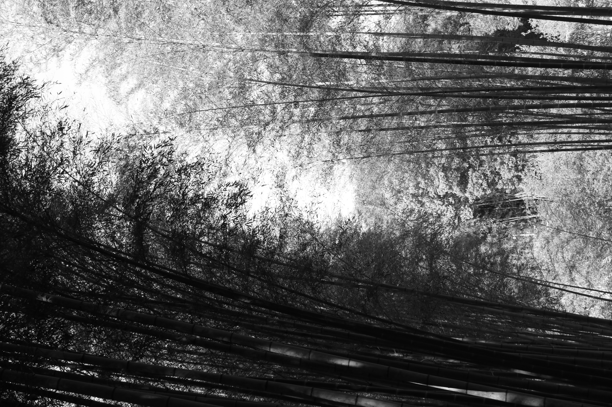
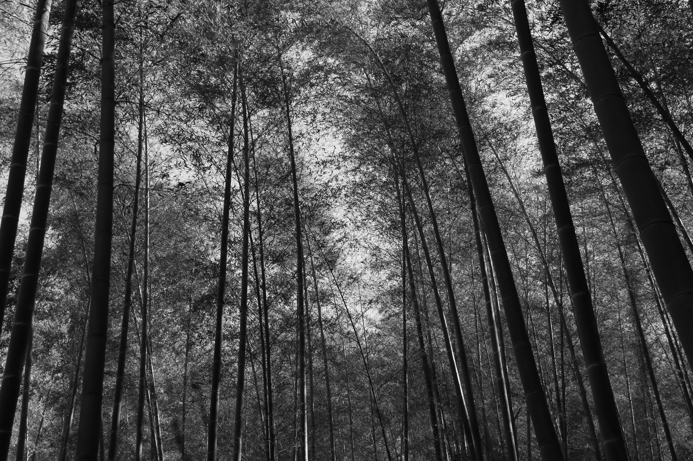

There is a specific kind of focus required to turn a flat-packed box into a piece of furniture.

As I worked on a set of shelves this week with my oldest son, I was reminded of a day four decades ago when two grandfathers faced a similar challenge.

My father and Mr. **I**—men in their late fifties and mid-sixties—were tasked with building a tricycle.

Armed with a few basic tools and a set of paper instructions, they were tackling a mechanical puzzle they had not encountered before.

On the surface, there was a barrier between them.

My father, even though, he had lived in US for nearly 15 years, did not have polished English.

Mr. **I**, for his part, spoke no Korean.

Yet they were united in this effort.

------------------------------------------------------------------------

The bridge between them was 日本語 (Japanese). They achieved their working knowledge in a different time and place.

They were born 6,000 miles apart and grew up under a vastly different environment.

According to Mr. **I**'s biography,

> He enlisted in the Navy and was selected to take a crash program in the Japanese language, emerging as an interpreter-translator with a commission in the U.S. Marine Corps. He participated in the campaigns of Saipan, Tinian and Okinawa as an intelligence officer with the 2nd Marine Division, and served in the occupation of Japan from 1945 to 1948.[^1]

[^1]: <https://web.archive.org/web/20041119163946/http://www.reedirvine.net/biography.html>

My father's language training came out of a necessity.

My father was born during the Japanese occupation of Korea.

By the time he was born, the Japan had been in Korea for 20 years and would be there for another 15 years.

He was not only exposed but worked side by side with Japanese people at a furniture factory. In a strange twist of history, when the Japanese fled after their defeat in World War II, the factory manager’s house became my father’s home.

Instead of hurrying through the task, they took their time. Perhaps comparing their services in WW II and Korean War.

Saw them huddled over a set of handlebars and had back and forth discussions, all inside the garage.

The assembly of the tricycle was no longer the main objective.

.jpg)

------------------------------------------------------------------------

Mr. **I** passed away in 2004 and my father followed in 2020.

I may not out live things that I assemble these days. The wood and metal are indifferent to time in a way that we are not.

However, I will remember the bond of love and appreciation among a parent, a child, and a grandchild.

As well as the appreciation for the people of past generation.

Their examples of hard work, sacrifices during the war and their willingness to serve their family and the nation.

I can imagine they are visiting with one another and reliving that one afternoon in December back in 1980s and building yet another layer of friendship and relationship.

