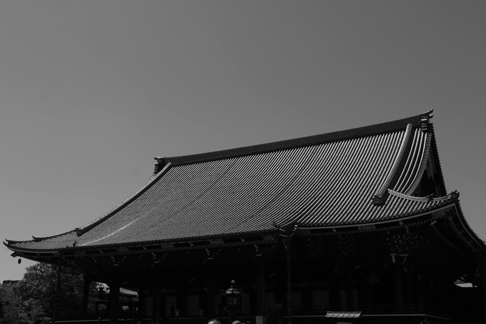

There is a strange alchemy that happens on a long flight, where the limited screen size and physical confinement can make even the most unlikely stories feel resonant.

I had initially dismissed a certain film as too far-fetched, even for a movie script, to be taken seriously.

It tells the story of an actor in Tokyo working for a rental-family agency—playing the role of a father or a husband for those in need of an emotional stand-in.

Yet, as I watched, the movie's exploration of manufactured sentimentality began to ring true.

It effectively highlighted the emotional toll of modern isolation, blurring the line between the reality we live and the roles we perform for the sake of others.

------------------------------------------------------------------------

As L. Robert Kohls has observed[^1] in the article, **The Values Americans Live By**, cultural values can often be categorized into two distinct groups: those of a young, experimental nation like the United States, and those of more established, traditional societies.

[^1]: https://spencerirvinereed.github.io/RC-Trail-Stories/posts/20240530%20Two%20Cultures/

Where the American value system prioritizes Directness, Openness, and Honesty, more traditional cultures often prefer Indirectness, Ritual, and the preservation of "Face".

I grew up observing the latter.

Although I have had fifty years to observe, reflect upon, and reconcile these differences, a recent visit to a more traditional country brought back a layer of thinking I had long ago dismissed as irrelevant.

It forced me to look again at the things we leave unsaid, and the rituals we perform to maintain the public image while the private reality remains hidden beneath.

------------------------------------------------------------------------

Enduring generals are those who not only master the treatises of war but can also recognize and pivot based on the terrain and the flow of the moment.

In the same way, while understanding the expectations of a given society is a necessary starting point, the work of a universal agent goes deeper.

To reach this state is to synthesize the values of many worlds, choosing—or even abandoning—long-standing traditions for the benefit of the person you are serving.

At this level, you are no longer a student of ethics or a transient visitor in a foreign land.

You are establishing a foothold into a realm that few access.

You become a holder of a universal, cultural passport—one who sees people and society as they were and as they are to be, but more importantly, recognize what they need in the present moment.

And that work of recognition begins, as it must, with oneself.

