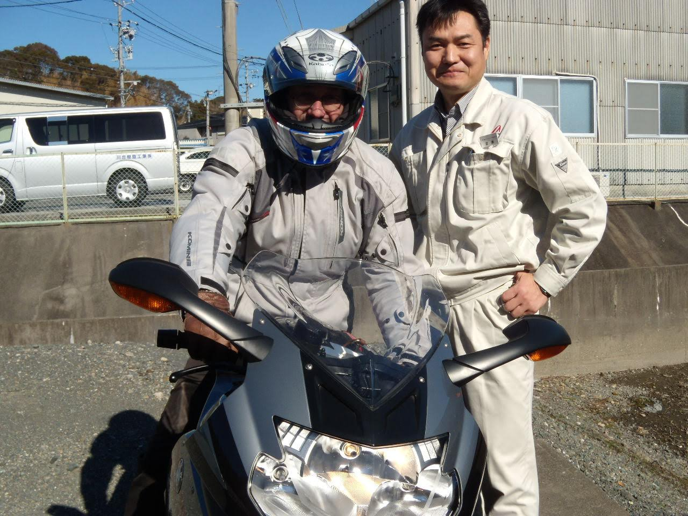
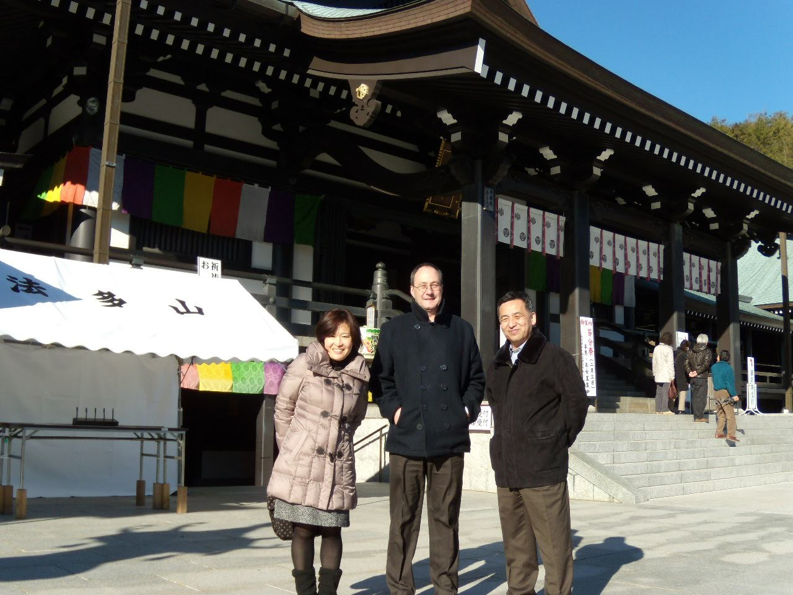

From September 2012 to September 2016, I coordinated a technology transfer between a Japanese catheter manufacturer in Shizuoka 静岡県 and facilities in Utah and Texas.

The work involved frequent visits to a company that had been integrated into Asahi Intecc—trips that almost always fell in the crisp transition of autumn or in the middle of winter.

We never saw the cherry blossoms of Sakura (桜) or Hanami(花見).

Instead, we experienced Shizuoka by its moderate temperatures and the heavy humidity that made the winter air feel far colder than the thermometer suggested.

It was in this climate that a unique bond formed between our R&D Director and the Plant Manager, Mr. Watanabe.

They shared a passion for motorcycles, specifically BMWs.

One winter day, after a conversation about their shared hobby, Mr. Watanabe arrived the next morning in full riding gear. He didn’t just bring his motorcycle for our director to admire; he insisted our R&D Director try it out.



```{r}
library(leaflet)

# Location data
locations <- data.frame(
  name = c("Izakaya", "Kaiseki", "Hattasan"),
  lat = c(
    34.75226622497618,
    34.747569314472564,
    34.73795808837415
  ),
  lon = c(
    137.96005091044262,
    137.92907476153815,
    137.97773012223948
  )
)

# Create map
leaflet(locations) %>%
  addTiles() %>%
  addMarkers(
    lng = ~lon,
    lat = ~lat,
    popup = ~name
  ) %>%
  fitBounds(
    lng1 = min(locations$lon),
    lat1 = min(locations$lat),
    lng2 = max(locations$lon),
    lat2 = max(locations$lat)
  )
```

That gesture was typical of Mr. Watanabe.

He personally led the hosting of our U.S. contingent, navigating the delicate balance between professional duty and personal friendship.

He looked after us with meticulous care—whether we were dining at refined kaiseki(懐石) restaurants, walking the grounds of the ancient Hattasan Soneiji Temple (法多山尊永寺), or sharing a late-night table at his favorite izakaya (居酒屋) near Aino Station (愛野駅).



Hosting in this traditional context often involved alcohol.

Mr. Watanabe would exchange bottles with our director, and when the night ended, he would quietly order a 運転代行, Unten Daiko—a professional driver to take him and his car home—or he would catch the Tokaido Line (東海道本線) back to Toyodacho Station (豊田町駅).

He extended himself for us, making sacrifices of time and energy that seemed, at the time, to be the hallmark of a dedicated professional.

We eventually returned the favor. However, we could not replicate the level of involvement he displayed.

He visited Utah and Texas, also in winter. We enjoyed steak dinners, a game of baseball, and a tour of indoor horse stable.

It was only much later that we learned the true weight of his hospitality.

During those years of bike rides, temple visits, and shared drinks, Mrs. Watanabe was undergoing cancer therapy. She passed away shortly after our project concluded.

I did not know Mr. Watanabe before the project, and I will likely never see him again.

But in those years of working together, I learned the meaning of hosting with love.

> We love him, because he first loved us. 1 John 4:19

It is more than the logistics of a visit; it is about doing one’s duty as a friend and a human being—even, and especially, when the unseen burdens of life are at their heaviest.


