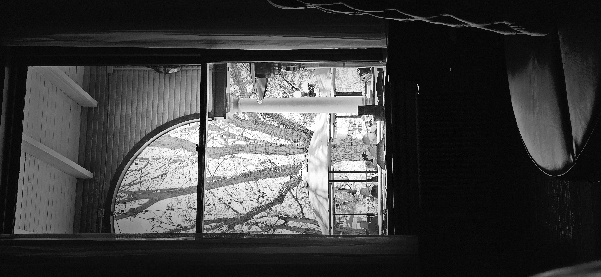

Weddings in Utah used to be entirely predictable.

Most were held within a church, bringing together people who shared a similar culture, faith, and background.

It is hard to pinpoint precisely when the cultural landscape began to change, but the shift has occurred: today, there are far more wedding receptions held outside the traditional church cultural halls, and the brides and grooms increasingly represent different cultures and historical memories.

------------------------------------------------------------------------

In contrast, the changes to the seasons along the Wasatch Mountains are not so subtle.

Here, nature operates on a dramatic, sometimes volatile timeline.

Late-season snow and sudden temperature drops regularly occur as late as April, and can occasionally surprise us even into June, wreaking havoc on local fruit growers who depend entirely on nature’s timing.

Because the mountain weather seldom follows a strict calendar, I’ve found that a more accurate measure of the changing seasons isn't the thermometer outside.

It is seeing the wedding announcements begin to appear on the refrigerator, tracking which spring and summer weekends must be left open.

------------------------------------------------------------------------

For this particular weekend, we had two commitments.

Conveniently, one began at 5:00 PM and the other at 7:00 PM. Factoring in a thirty-minute travel time, we calculated our route to cover the second half of each event.

The first stop was the union of two Korean families.

The event was highly structured, well-planned, and meticulously designed to introduce the couple and their respective families to the attendees.

The highlights of the program were the tribute songs performed by family and friends. Renditions of ABBA’s *"Super Trouper"* and a sweeping Korean ballad rivaled the performances of professional singers.

It was all the more remarkable given they were likely operating without professional audio gear or enhancing software—relying instead on pure vocal talent and emotion.

As I was enjoying the performance, the local Korean church leader stopped by our table to visit.

We discussed how well his congregation has been thriving recently.

With visible, well-deserved pride, he shared the number of weddings his unit would be hosting this summer.

The local Korean unit already boasts an unusually high birth rate; these upcoming summer weddings will only add to that momentum.

------------------------------------------------------------------------

The second wedding, by contrast, felt less structured, self-initiated, and beautifully spontaneous.

We arrived nearly forty-five minutes after the start, slipping into an environment where, even before entering the venue, one could feel the energy

A live band was performing the 1980s funk favorite, *"Brick House"* by the Commodores.

Then came a moment of unexpected encounter.

An Asian person, about six feet tall with a full beard, approached us and introduced himself.

I didn't immediately recognize him—until he smiled and pointed across the room toward his parents.

His father was the very same local Korean church leader who had supported Sister K decades ago when she was preparing for her mission. Moreover, their family had attended our own wedding reception years ago.

We spent the rest of the evening remembering the old days and bridging the decades by sharing news of our families.

As the night wound down, we exchanged phone numbers.

Later that evening, a summarizing text arrived on my phone from him:

> *"Really awesome to see you both. You look exactly how I remembered you! Good genes."*

------------------------------------------------------------------------

Church units, social institutions, and civil organizations will always evolve and adapt to the times.

But no matter the format of the future events that celebrate the joining of two families, the core remains unchanged.

The older generation will rejoice in the union of the young, anticipating and drawing lines of stability from the past into the future.

The new generation will develop their own unique, independent ways of celebration—moving from structured ballads to funk bands without losing the underlying reverence for family.

And in those brief moments, friends will gather—perhaps for the only time in years or decades—to renew a friendship, regain a memory, and stand together and hold for a moment, the passing of time.

Thus, the cycle renews itself along the Wasatch Front and elsewhere.

Congratulations to the newlyweds and their respective families.

