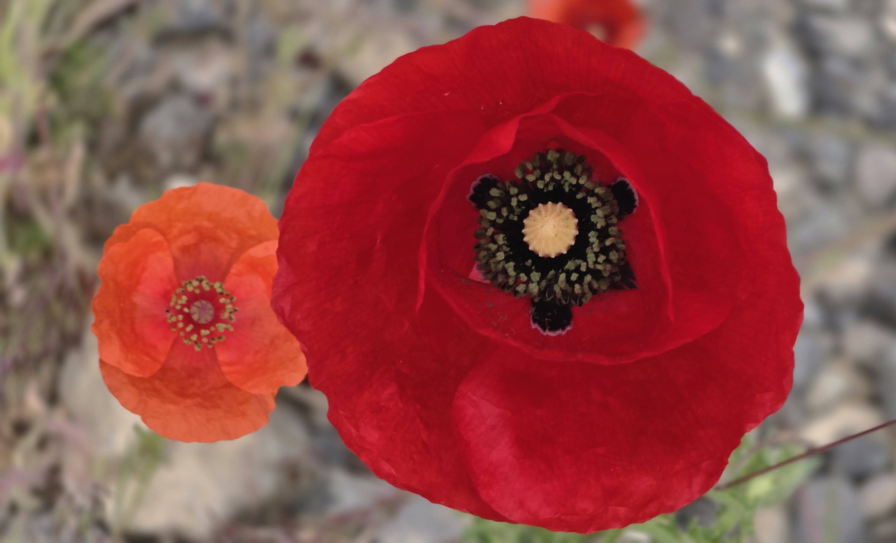
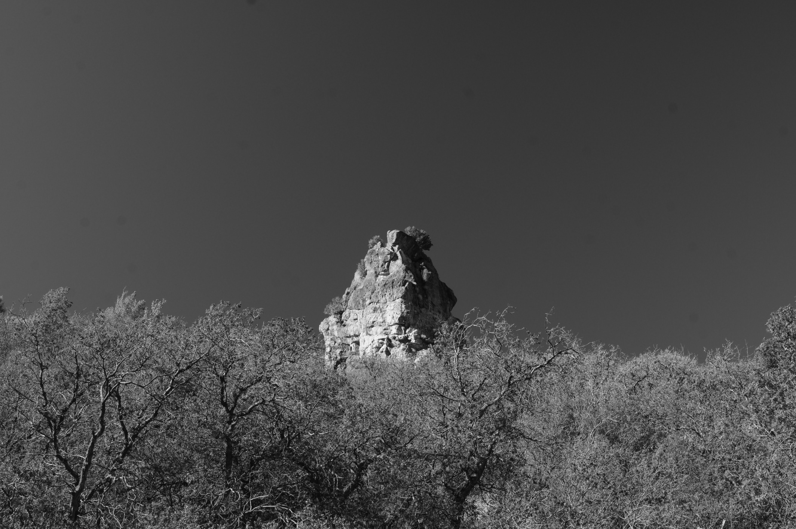

During her school years, my mother had a Japanese name, mandated by the occupying administration.

Her assigned name was Tomoko, and because it sounded close to the word *Tomato*, she was teased a lot by the other children.

Not sure whether it was causation or correlation, but we ate far more tomatoes growing up than the average family. Although it wasn't my favorite fruit (or a vegetable) as a child, my mother made it so through a simple, quiet ritual.

First, she would cut the tomatoes into horizontal wheels—even round slices.

Then, those slices would be placed inside a container the size of a cereal bowl.

Between each layer of tomato, she would sprinkle an ample amount of granular sugar. Some sugar melted and mixed with the pooling juice, while some remained sweet, cruchy clusters.

Both aiding in transforming the tomato into a savory treat.

Because of the tomato's long growing seasons in Korea, we ate a plenty of them during those years.

---

Once, when I was young, I told my mother that some older students at school were teasing me.

She immediately took action.

After finding out exactly who they were, she confronted them directly, making it clear that she would not tolerate that behavior—especially around her child.

I don't remember if the teasing fully subsided after that day.

What I learned for certain, however, was that my mother would always protect me.

As she had done with those sugary tomato treats and the schoolyard bullies, Mom tried her best to shelter us from the hardships of the world.

Whenever she could, she would add ingredients, that became medicine, to our lives.

To make the trials a little lighter, a little sweeter, and more meaningful.

---

Nowadays, I eat a tomato just like an apple—plain, raw, and without those sweet, caramel-like additions.

Likewise, I no longer have my mother and father standing before and beside me to bear the brunt of life’s struggles.

The responsibility is entirely upon me and Sister K now.

Yet, as the seasons shift and another spring arrives and transition to summer, along the northern hemisphere, I find myself deeply missing their strong, unflinching approach to life, and their quiet effort to leave behind a foundation for us to build upon.

Thank you, Mom, for your sacrifices.

Here’s to another season, and another tomato treat in your memory.

Mid-May 2026

