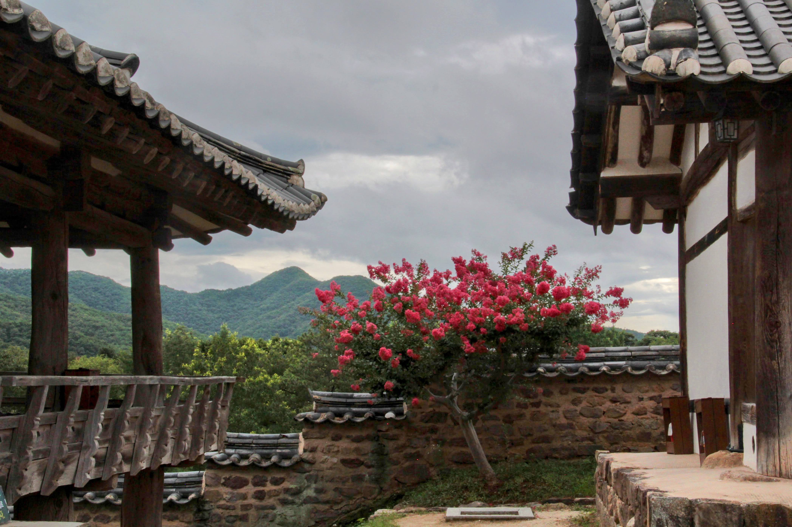
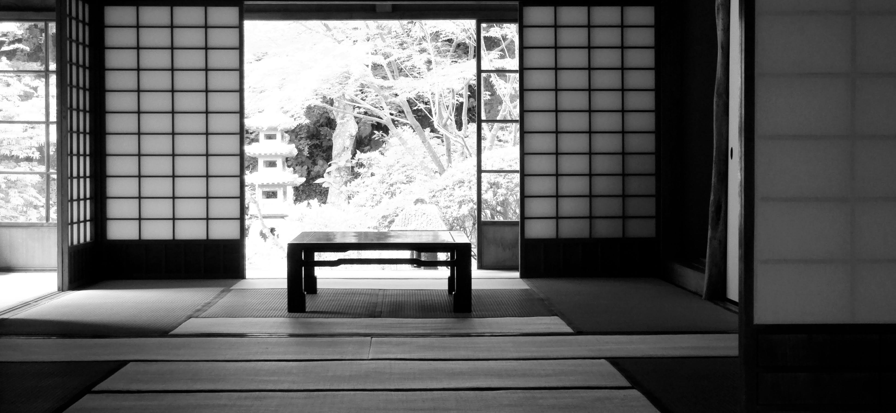
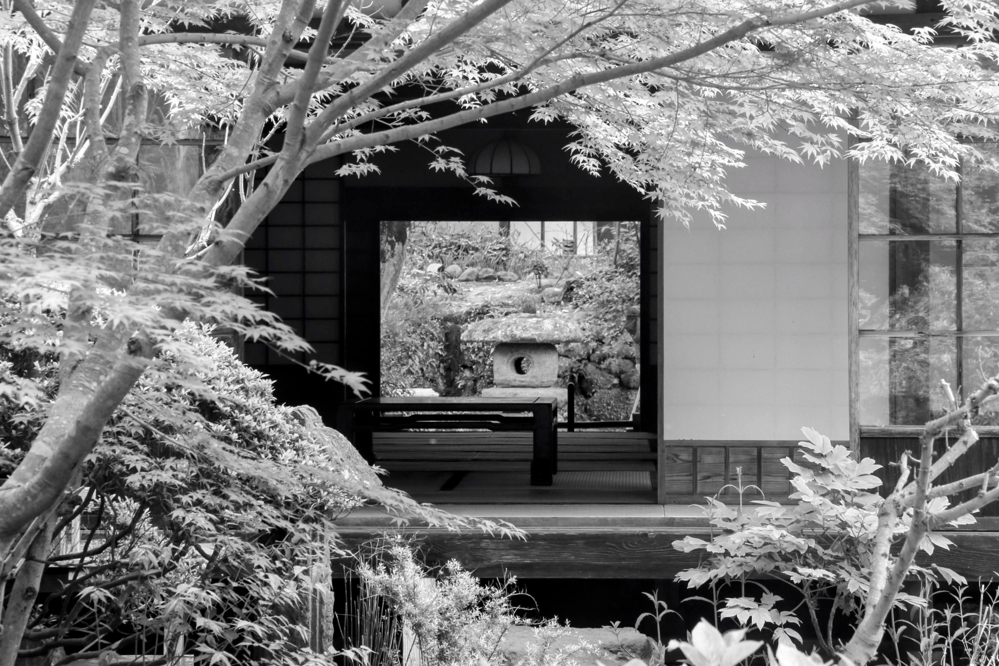

```{r}
library(leaflet)
library(dplyr)

# 2002 FIFA World Cup stadiums (Japan + South Korea)

stadiums <- data.frame(
  name = c(
    # Japan
    "Sapporo Dome",
    "Miyagi Stadium",
    "Kashima Soccer Stadium",
    "Saitama Stadium 2002",
    "International Stadium Yokohama",
    "Shizuoka Stadium ECOPA",
    "Niigata Stadium",
    "Nagai Stadium",
    "Kobe Wing Stadium",
    "Oita Stadium",

    # South Korea
    "Seoul World Cup Stadium",
    "Busan Asiad Stadium",
    "Daegu World Cup Stadium",
    "Incheon Munhak Stadium",
    "Gwangju World Cup Stadium",
    "Daejeon World Cup Stadium",
    "Jeonju World Cup Stadium",
    "Ulsan Munsu Stadium",
    "Suwon World Cup Stadium",
    "Jeju World Cup Stadium"
  ),

  country = c(
    rep("Japan", 10),
    rep("South Korea", 10)
  ),

  lat = c(
    # Japan
    43.0152,
    38.3365,
    35.9919,
    35.9030,
    35.5100,
    34.7433,
    37.8826,
    34.6137,
    34.6567,
    33.2008,

    # South Korea
    37.5683,
    35.1903,
    35.8800,
    37.4351,
    35.1331,
    36.3665,
    35.8687,
    35.5350,
    37.2861,
    33.2461
  ),

  lon = c(
    # Japan
    141.4103,
    140.8817,
    140.6400,
    139.7176,
    139.6063,
    137.9690,
    139.0594,
    135.5200,
    135.1697,
    131.6641,

    # South Korea
    126.8972,
    129.0614,
    128.6070,
    126.6934,
    126.8747,
    127.3170,
    127.1230,
    129.2590,
    127.0369,
    126.5093
  )
)

# Create map
leaflet(stadiums) %>%
  addTiles() %>%

  addCircleMarkers(
    lng = ~lon,
    lat = ~lat,
    radius = 6,
    stroke = TRUE,
    fillOpacity = 0.8,
    popup = ~paste0(
      "<b>", name, "</b><br>",
      country
    )
  ) %>%

  addLabelOnlyMarkers(
    lng = ~lon,
    lat = ~lat,
    label = ~name,
    labelOptions = labelOptions(
      noHide = FALSE,
      direction = "top",
      textsize = "11px"
    )
  ) %>%

  fitBounds(
    lng1 = min(stadiums$lon),
    lat1 = min(stadiums$lat),
    lng2 = max(stadiums$lon),
    lat2 = max(stadiums$lat)
  )


```

The home team kept winning, and with every victory, the crowd grew larger.

Soon, the stadium could no longer hold the crowd or their energy, and the celebration spilled out into the streets, a sea of rhythmic chanting and shared euphoria.

> 대\~한민국 !!!

I remember being surprised to learn that Koreans that I knew living abroad—specifically from places like Los Angeles, California—were buying plane tickets and flying across the Pacific just to watch the matches in person.

The irony wasn't lost on me: I lived within walking distance of the very stadium where they were scheduled to play, yet the thought of fighting the crowds to get a ticket never even crossed my mind.

Instead, I watched the highly anticipated U.S. vs. Korea match on a screen, surrounded by local church members and missionaries.

During the game, the U.S. team executed a particularly brilliant, skillful play, and without thinking, I cheered out loud for them.

The room went quiet.

The local members looked at me, completely shocked that I would root for the opposing side.

It was a very good thing the match ended in a 1-1 draw.

When the game was played, 10 June 2002, I had lived in the United States for over twenty years.

Conversely, if I added up my childhood years and my later time spent as an expatriate, I had lived in Korea for fifteen years.

Hence the quandary.

When two halves of your life face each other on a soccer field, which team do you root for?

More importantly, how do I define the hyphen in my own identity? Am I a **Korean-American**, where "Korean" modifies the foundational reality of being an American? Or am I an **American-Korean**, an American identity built upon an immutable Korean core?



------------------------------------------------------------------------

The soccer match revealed, if only momentarily, exactly where my loyalties lay: with both.

More than that, it demonstrated what I valued within each of those distinct cultures.

Friendship, loyalty, and a sense of belonging.

I had allowed myself to get caught up in the pure, collective euphoria of the moment alongside twenty million fellow Koreans.

A similar excitement had also been an integral part of the expatriate assignment that had brought me back to my home country three years earlier.

Yet, when the tournament finally ended with Korea’s loss to Turkey in the consolation match on June 29, 2002, my chapter as an expatriate in my home country drew to a close as well.

Had I accepted the hosting group’s offer to stay on, I could have easily spun that expatriate arrangement into a mini-career.

It is easy to find excitement in your work as well as during a massive sporting event, especially when the home team keeps winning and the streets are alive with excited fans.

But I realized that the things in life that truly require our presence rarely yell so loudly. They do not come with stadium lights or roaring crowds. Instead, they usually speak in a very soft voice.

That voice was Sister K saying,

> It is time for us to go back to our home in America.



------------------------------------------------------------------------

Ultimately, it was never a rigid matter of choosing one over the other: Korea versus America, or professional ambition versus family life.

We need both.

The challenge is knowing when a particular season has expired, and realizing that the cheering crowd has moved on.

More importantly, it is recognizing the difference between a real home and a temporary stadium—understanding that a global organization and multinational companies, by its very nature, is primarily built to host an event and to conduct businesses across national border, not to look after the quiet well-being of a person or a family.

That essential work--maintaining well-being of an individual and family--will continue without notice and without much fanfare.
