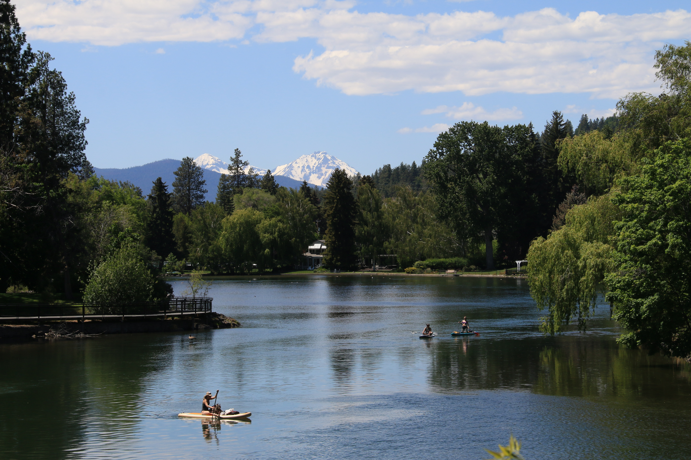

When navigating a new town or searching for a place to eat, my approach relies on a specific philosophy: it is not **either/or**, but rather a balance of **both**.

Before I travel to an unfamiliar city, I consult online navigation to study the digital representation.

I scan the grid, noting prominent locations, highway intersections, and the natural flow of the streets as city founders may have envisioned. 

But a digital map is an inadequate preparation.

Once I actually enter the town, I begin to search for and sync with the physical landmarks I noted earlier.

Modern day orientation is a mix of both digital databases and real-world awareness.

------------------------------------------------------------------------

Recently, I landed in a town I had never visited before.

Looking out from the airplane window as we made our descent, the geometry of the landscape immediately became clear: a wall of towering, 14,000-foot mountains dominated the western horizon.

My flight touched down at exactly 12:01 PM local time. As the plane taxied, my internal clock began mapping out the afternoon. I allowed five minutes to taxi to the modest, four-gate terminal, and budgeted another thirty minutes to clear the counter and pick up my rental car.

By 12:36 PM, with the keys and the contract in hand, I was ready to navigate the local cuisine scene.

------------------------------------------------------------------------

While waiting at the rental car counter, I scanned the online listings for nearby restaurants.

A promising pattern quickly emerged: local, independent offerings vastly outnumbered the national chains. I found myself leaning toward comfort food—specifically, a place that could serve a proper bowl of steamed white rice.

Leaving the airport, I drove past an initial spot that seemed like a safe, predictable choice, but decided to press on toward the heart of the downtown area.

As I navigated the grid, with on-line navigation disabled, I spotted a family-run place in the southeast block of Glacier and 6th Street.

However, the city’s strict web of one-way streets caught me off guard. I missed the lone entrance to the parking lot, forcing me onto an involuntary, scenic tour of the town before I could double back.

When I finally parked and stepped inside, the owner's son and Mauritia welcomed me.

The interior carried the unmistakable, charming layout of a converted space that had once anchored a commercial fast-food franchise.

Outside, the sign simply read: *Cantonese Szechuan Cuisine*.

Then, I heard it.

Floating through the dining room was the unmistakable voice of Cantopop Pop Diva Shirley Kwan **關淑怡**, performing her 1989 hit *難得有情人*—"Happy Are Those in Love."[^1]

[^1]: It is rare to meet someone who truly loves and understands you.

Indeed, happy travelers are those who can find a quiet place to sleep well, and an authentic, well-cooked meal to sustain them.

In that unassuming dining room, with the mountains at my back and the familiar music in the air, I had found exactly what I was looking for and needed.

------------------------------------------------------------------------

Digital navigation allows us to find places in this mostly impersonal world.

It can take you nearly anywhere in the world, guiding you down to the exact, predetermined coordinate.

But if your destination is a place of emotional solace rather than geography, the map falls short.

There is no shortage of crowdsourced recommendations designed for the masses.

Yet there are times when I find myself searching for something entirely personal—a recommendation based solely on my own background, Korean upbringing, my selfish needs at that specific moment.

I deeply appreciate the utility of modern technology, and I value the collective wisdom of those who have reviewed these places before me.

But data cannot forecast decisions driven by nostalgia.

There are moments when I want to close the app, step out into the uncharted, and establish my own private network of landmarks—places that quiet the noise and fulfill my soulful needs.

Sometimes, it is a small, obscure place.

Family-run, infused with local flavor, based on traditional oral clan practices, and a bowl of perfectly steamed white rice.

As I finished the lunch portion of my meal and packed away the dinner portion, I had notched another entry into my own world wide navigation tool for the soul.

