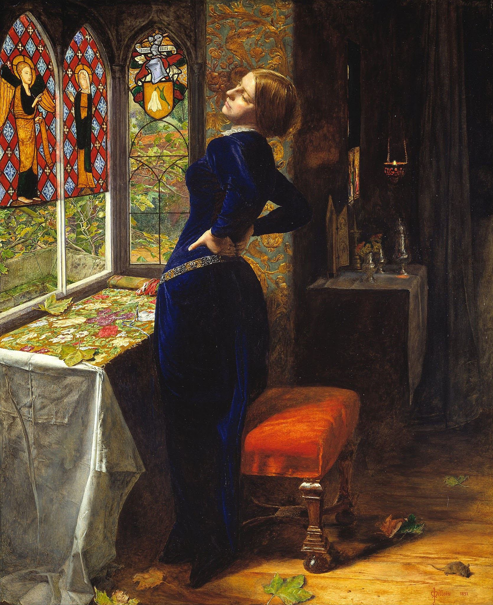
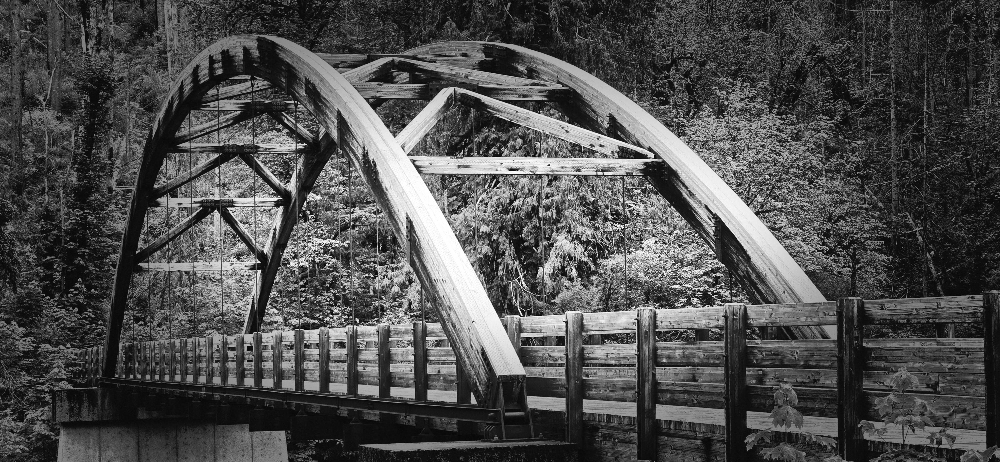
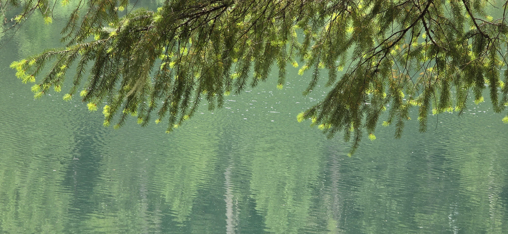

To borrow the book, I first had to revive my local library card, which had expired due to years of inactivity.

I pulled five titles from the New Non-Fiction section.

I hadn't read any prior reviews, nor did I have any personal recommendations to go on.

Instead, I relied entirely on the oldest, most reliable instinct in the book-buying world:

I selected it based on the cover.

{width="50%"}

Spreading across the dust jacket was an image of *Mariana* (1851), the iconic oil painting by English artist Sir John Everett Millais, a co-founder of the Pre-Raphaelite Brotherhood.[^1]

[^1]: https://en.wikipedia.org/wiki/Mariana\_(Millais)

Universally celebrated for its striking, saturated color palette, meticulous detail, and its profound exploration of the Victorian themes of isolation, entrapment, and deep melancholy.

Structurally, it is a short volume. It spans just 196 pages, but a significant portion, 29 percent, of its footprint is dedicated to academic requirements: 29 pages of chapter notes, a 23-page bibliography, and a 5-page index.

The author is a Fellow in Theology at St John's College at the University of Oxford—a pedigree that promises a masterclass in prose.^[doi 10.1017/9781009519847 , https://www.cambridge.org/core/books/theological-imagination/theological-imagination/A4B27233CFA72BC19DEDFBF4660DF308]

Yet, as I turned through the pages, which were strewn with 35 separate illustrations and figures, I found myself continuously waiting for enlightenment.

I waited for a striking turn of phrase, a vivid combination of words, or a profound thought to jump off the page and grab me.

It never happened. The text remained flat.

------------------------------------------------------------------------

Then, a sudden, uncomfortable realization hit me: I have been conditioned by the modern digital landscape.

My mind has been trained to scan for Twitter/X-like phrases, or the punchy, stylized text tailored for Instagram-ready captions.

I have chosen to take part in those offerings and worked in an era dominated by flashes of high-stimulus data.

There are topics specifically engineered to flare up for a brief moment and vanish just as quickly as they appeared.

Yet, in that fleeting moment, those digital prompts sway our thoughts and fixate our emotions, artificially accelerating both our heart rates and our brain activity.

Further separating persons into opposing camps with digital accuracy and seal of assurance.

Too often we mistake that sudden spike in adrenaline for depth.

However, the most vital topics and enduring life lessons cannot be captured, condensed, or even properly conveyed by modern social media tools.

They require a completely different architecture, both space and time.

------------------------------------------------------------------------

This limitation becomes instantly clear when you step away from the screen entirely.

America is blessed with a vast, stunning spectrum of natural abundance. Although the modern population tend to congregate in dense metropolitan areas, this raw bounty is often available just a short drive away from the city limits.

Out in these quiet, rural landscapes, you can still find and study the slow, evident progressions of the natural world.

Nature teaches us a humbling, ancient lesson: that despite all of our technological advances, mankind is remarkably small when compared to the sheer vastness of the horizon.

Furthermore, true majesty stubbornly defies our human obsession with labels, databases, and classifications.

It refuses to be neatly packaged.

Even with the most sophisticated digital tools at our disposal, the true scale of the world can only be fully appreciated in person.

It cannot be adequately cataloged, and it certainly cannot be indexed.

Academic illustrations and curated travel narratives are helpful, but they represent only a microscopic fraction of the reality.

While a beautifully filtered travel blog or a punchy Instagram entry can strike a brief, temporary spark in our minds, that flare quickly vanishes.

Once the screen fades, we are left empty, wandering blindly or peer-recommended in search of the next digital dopamine hit.

In contrast, the true journey of life—and the profound lessons that shape us—cannot be lived in a high-speed feed.

They are to be captured in a perpetual "work-in-progress" mode.

We can only accumulate our wisdom slowly, as we are ready: compiling our own mental notes, creating our own personal indexes, and logging the places we have physically visited alongside the places we still yearn to see.

In the end, we cannot rely on an Oxford fellow or an internet algorithm to translate the world for us.

True orientation requires us to step out into the uncataloged wild, close the book, look up at the horizon, and begin understanding things entirely in our own way.

DOI: <https://doi.org/10.1017/9781009519847>
