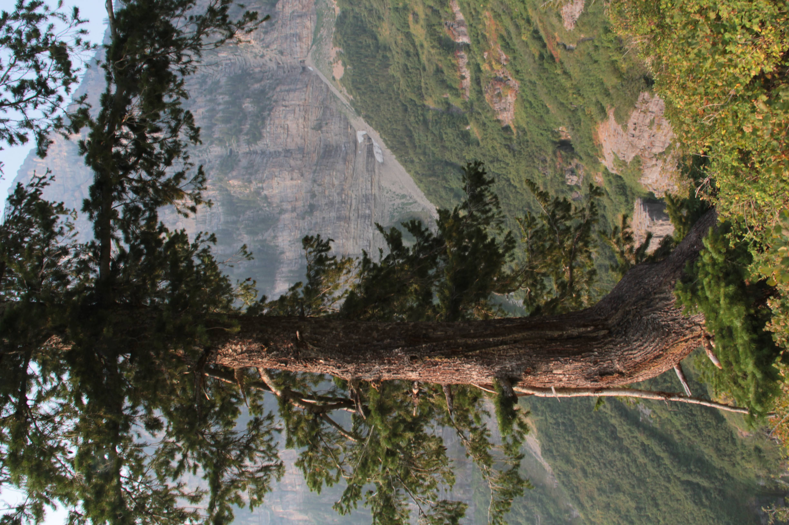
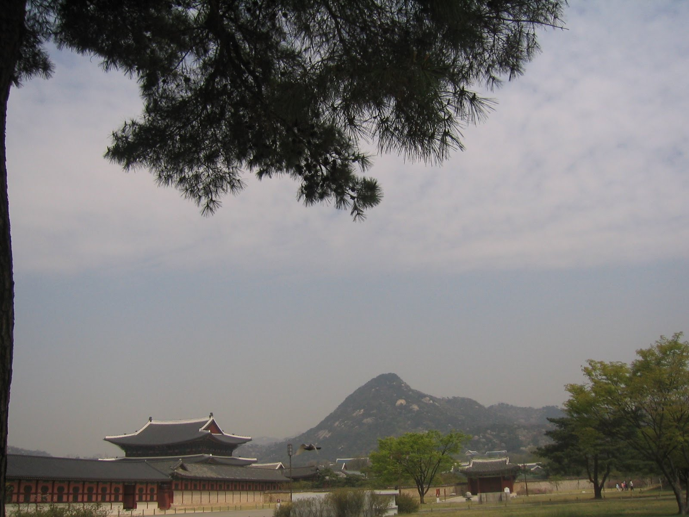
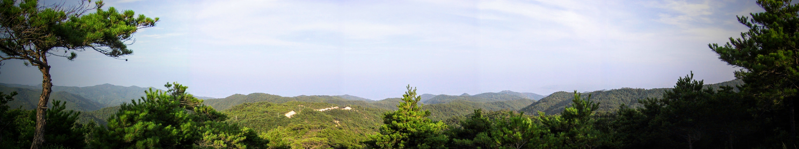

In the early 1960s, the Nobel Literature and Pulitzer Prize-winning author Pearl S. Buck visited the South Korean countryside.

During her travels through the rural landscape, she witnessed a scene that stopped her and ask a question: a farmer was walking slowly down the dirt road, leading his ox home after a long, day of labor in the fields.

What struck her as odd was that the man was strapping a heavy *jige* (지게)—a traditional Korean wooden A-frame backpack—to his own shoulders, manually carrying his own share of the harvested hay rather than piling it onto the animal's back.

Intrigued, she approached the farmer and asked why he didn't simply let the ox carry the entire load. The man replied simply:

> "I worked all day in the field, but so did the cow.
>
> It is only fitting that we both carry our own burdens home."

In old Korea, owning livestock was a luxury, representing the primary engine of a household's survival.

To protect and care for these invaluable animals, farmhouses were built with an integrated *oeyanggan* (외양간)—a built-in cattle stall located directly within the main structure of the home, typically right off the kitchen area.

This design allowed the heat from the family's *ondol* (underfloor heating) cooking fires to keep the animal warm during harsh winters.

Because of this profound proximity, these animals were never viewed merely as disposable beasts of burden or cold agricultural assets.

They were treated as partners in survival—integral members of a family who labored together by day, rested together by night, and lived under the proverbial same roof.

### **The Living Network**

Some thirty years after Pearl S. Buck’s journey through the countryside, I found myself standing in that very same reality. I visited a small, rural town near Hyeonchungsa (현충사, **顯忠祠** ), located about an hour north of Daejeon (대전, 大田)

I was there with Sister K, who was introducing me to her extended family.

Her father’s older brother lived in a historic home that had been handed down through generations of oldest sons.

Walking down the path, the fabric of the community revealed itself: just a few doors away lived Sister K’s grandfather’s brother.

Further down the road stood the homes of her *yukchon* (육촌)—her second cousins. In fact, the majority of the houses in the entire village belonged to relatives of the same clan.

Surrounding this tightly knit web of homes were active fields and dedicated spaces for domesticated animals.

The family welcomed us with utmost hospitality, insisting that we take the main bedroom for our stay.

To accommodate us, they quietly moved their own sleeping quarters into a side room—one that had been directly converted from its original use as an *oeyanggan* (외양간), the old cattle stall.

It was July, and the heavy summer heat of the day was echoed in the evening by an absolute euphony of cicadas drumming from trees that surrounded their ancestral home.

During our stay, we walked up a nearby hill to visit the family grave site, where generations of ancestors overlooked the very fields their descendants were still farming.

For someone like me—who grew up entirely in urban environments, far removed from agriculture and livestock, and as the child of refugees from the North who lived without the embrace of an extended family network—this visit was deeply jarring.

It was a profound shock to my system to see a family not just surviving, but genuinely thriving within a rural, agricultural ecosystem.

I was being introduced firsthand to an entirely different era—a way of life where mankind depended fully on the raw strength of animals, and where people, in turn, took sacred care of the animals that sustained them.

### **The Tectonic Shift**

Last year, Sister K’s uncle, who had hosted us so graciously decades ago, passed away at the age of ninety-six. He had lived in that very same ancestral home until his twilight years, when he finally moved in with his son to receive necessary in-home care.

With his passing, and with the steady departure of my own parents’ generation, we have lost something completely irretrievable: our innate, baseline ability to connect with the agrarian land and work hand-in-hand with domesticated beasts.

Improved roads, engineered land, and industrial machinery have permanently replaced that venerable scenery.

Between the 1960s and the 1990s, South Korea underwent a lightning-fast transformation, completely swapping its ancient agricultural foundation for a hyper-industrialized society.

Pearl S. Buck caught the twilight of that traditional world, and my own visit thirty years later captured a snapshot of a rapidly disappearing heritage.

Today, we are standing on the precipice of a remarkably similar tectonic change.

Physical labor and intellectual, creative work are being systematically replicated and replaced by robotics and artificial intelligence.

It is a pivot point that understandably induces an undercurrent of deep anxiety, fueled by the cold uncertainty of what lies ahead for humanity.

Yet, the solution to this modern existential dread seems to have been uttered some sixty years ago, on a quiet dirt road, by a farmer returning home from a day of shared labor with his ox.

As we step out into this unmapped digital future, perhaps our internal orientation requires us to update his ancient philosophy for the machine age:

> *"I have studied and learned all of my days, but so did the robot and the AI.*
>
> *It is only fitting that we both carry our own burdens to our eternal destiny and our home."*

