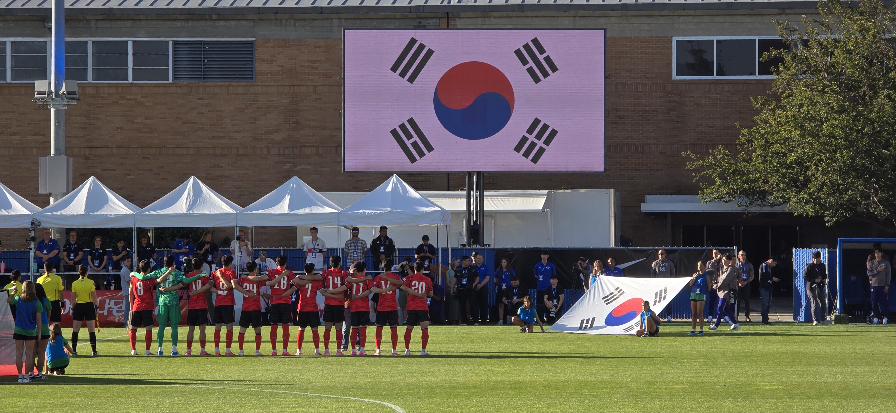
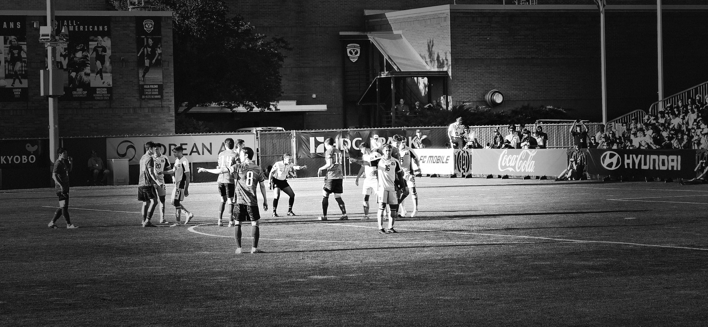
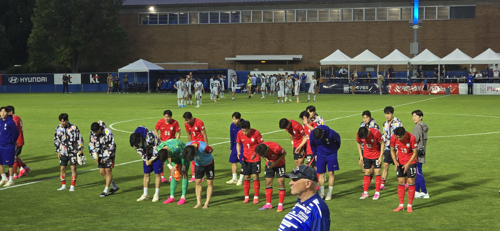

Garrison Keillor used to wrap up his weekly dispatch from a fictional, remote Minnesota town with a signature line:

> *"And that's the news from Lake Wobegon, where all the women are strong, all the men are good-looking, and all the children are above average."*

It was a charming piece of satirical Americana, a nod to the quiet pride communities take in their own.

Recently, while sitting in the stands at an International Friendly soccer match, Keillor's words found an unexpected, real-world resonance.

The match was held at a stadium just 2.7 kilometers from my home, a local venue with a nominal seating capacity of approximately 4,200.

------------------------------------------------------------------------

Looking around the stands after kickoff, I noticed how well-represented the Korean community was. I suppose other Koreans felt the same as I did, determined not to miss out on this unexpected gift delivered from the Mount Olympus of the FIFA world.

There are roughly 15,000 Koreans living across Utah.

Based on my visual estimate—Koreans made up at least a third of the 4,200 attendees—it meant that approximately 10% of the entire Korean population in the state had converged on this natural grass field.

Walking across the perimeter of the field after the game had started, my attention shifted from the stands to the players.

These young Korean athletes were physically imposing.

They were tall, muscular, and dominant when compared directly to their counterparts on the field.

They weren't just big; they were exceptionally quick, consistently winning the footraces to loose balls and dominating the aerial duels to win the heading battles.

Although soccer is deemed less physical than other sports, there was no shortage of intensity—the match featured plenty of hard clashes and fierce altercations on the pitch.

Our seats were situated close enough to the touchline that the barrier between the stands and the field completely dissolved in terms of vocal messages.

We were close enough to clearly hear the sharp, verbal strategies shouted back and forth among the players in the heat of the play.

In return, they were close enough to hear our voices of support and encouragement. Hearing cries of *"you are good-looking"* echo from the crowd, I suppose *"you are strong"* was understood by all.

------------------------------------------------------------------------

Historically, Korea was widely known as *Dongbang-yeui-jiguk* (동방예의지국, 東方禮儀之國)—"The Nation of Courtesy in the East."

Today, through the global phenomenon of *Hallyu* (한류, the Korean Wave), the nation enjoys unprecedented worldwide exposure through K-Dramas, K-Pop, and K-Foods.

That excellence extends to the pitch, the field, where top Korean players are routinely employed by premier global clubs.

As spectators, we felt a sense of pride in these athletic ambassadors, standing shoulder-to-shoulder with our cultural ambassadors on the world stage.

Statistically, the footprint of this Korean community is revealing.

It is estimated that between 7.3 and 7.5 million Koreans live outside of the Korean Peninsula.

Combined with an estimated homeland population of 78.2 million (51.6 million in the South and 26.6 million in the North), there are roughly 85.5 million Koreans.

Koreans constitute 1.03 percent of the 8.3 billion people on this earth.

When the National Team members step onto the pitch, they are representing those 85 million people.

No matter where the venue is, and regardless of the size of the stage, absolute excellence of sportsmanship is expected on the field.

It is hard to estimate the sheer volume of unseen, deliberate practice and not-so-friendly matches that occur in the quiet four-year intervals between major global tournament cycles like the World Cup.

I noticed the players took the field early before the game for a disciplined warm-up. Remarkably, even after the match concluded, they immediately took to the field again for a series of intense sprints to warm down.

Yet, before that final conditioning run, the entire squad of players and the coaching staff went entirely around the perimeter of the pitch, pausing to pay their respect with a bow to the fans who had stayed late into the evening.

We were well represented, indeed, by the Korean National Football Team.

------------------------------------------------------------------------

Not many of us will ever wear a national jersey or serve as official cultural ambassadors on a global stage.

However, all of us will have quiet, daily opportunities to reassure mankind's faith in the present and the future. That reassurance is forged through our own deliberate practice during private, unglamorous hours.

By doing the heavy lifting in the dark, we ensure that when we are finally placed in the spotlight, we can demonstrate that we, too, are world-class—and that we represent not only our own group, but also the rest of the world.

It is a standard that reiterates the words spoken by Garrison decades ago, expanding them from a remote shadows of a Minnesota town into an idealized global community:

> And that's to be expected when you are from Lake Wobegon, where all the men are strong, all the women are good-looking, and all the children are far above average—in strength, beauty, and wisdom.
