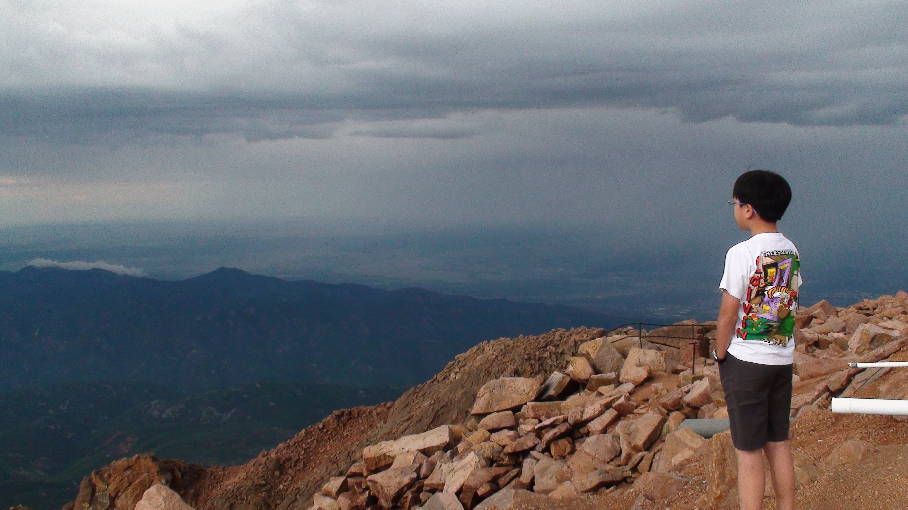

Was sitting next to my oldest son, with his wife and two little ones, waiting for our bowls of beef rice noodle soup to arrive.

In that lull before the food arrival, my son got sentimental and he brought up a memory from years ago that I had completely forgotten.

He reminded me of a time when we visited Colorado as a family.

------------------------------------------------------------------------

My sons were teenagers then, and had accompanied on my business trip.

During one of the evening meals, while we were waiting for our food to arrive at a restaurant, the boys began getting a bit rowdy.

Seeing this, the waiter made an effort to calm the children down, but did so in a condescending manner.

According to my son, I didn't let it slide.

I responded to the waiter directly:

> *"If you had done your part of the agreement and brought us our food on time, my children would not be rowdy."*

I could have chosen to stay quiet.

I would have normally accepted the input from the restaurant staff, swallowed the discomfort, and perhaps even scolded my boys to keep the peace.

But at that moment, something must have prompted me and protecting my kids from a condescension took precedence over being a paying customer.

I don't quite remember the professional reason for the business trip that took me to Colorado. I believe it was to visit a manufacturing vendor who was providing circuit boards for our projects.

I would work with a junior engineer from our headquarters in Woodland Hills and the host engineers, while my sons would take the car and busy themselves in town during the day.

But I do remember the journey itself: leaving home on a Sunday afternoon with my three teenage sons, piling into a Dodge 300-series sedan, and driving that 545-mile stretch of highway together.



------------------------------------------------------------------------

All these years later, the specific details of the technical work and the exchange at the restaurant have faded from my mind.

I couldn't tell you the any details of those circuit boards or the outcome of those vendor meetings.

But sitting with my grown son today, his wife, and my grandchildren, I realized that my actions at the restaurant did matter.

In the mind of my son, the food or the trip wasn't what stayed.

What stayed was the memory that his father was there, that he sat with his sons, and when it mattered that he stood up for them.

```{r}
library(leaflet)

locations <- data.frame(
  name = c(
    "Custom Location",
    "Garden of the Gods",
    "Pikes Peak"
  ),
  lat = c(
    38.90381278277922,
    38.8784,
    38.8409
  ),
  lon = c(
    -104.86348391031166,
    -104.8694,
    -105.0423
  )
)

leaflet(locations) |>
  addProviderTiles("CartoDB.Positron") |>
  addMarkers(
    lng = ~lon,
    lat = ~lat,
    popup = ~name
  ) |>
  fitBounds(
    lng1 = min(locations$lon),
    lat1 = min(locations$lat),
    lng2 = max(locations$lon),
    lat2 = max(locations$lat)
  )
```
