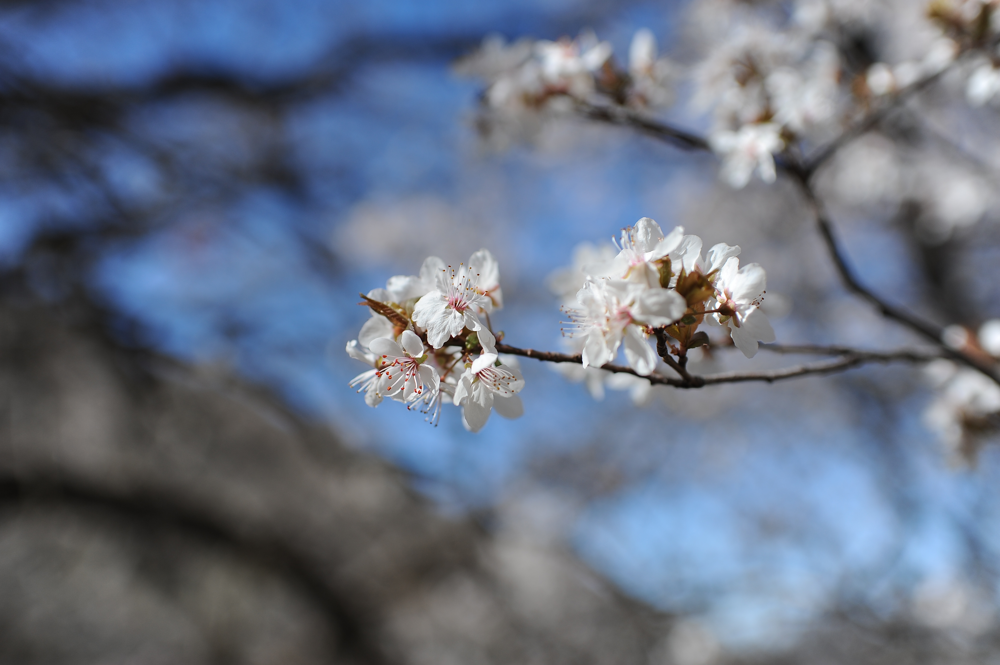
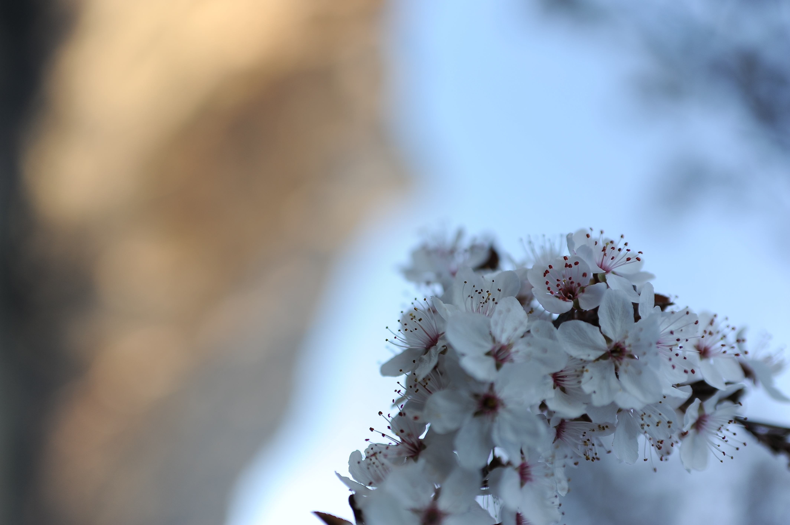

Sister K and I recently made our annual trip to visit our daughter’s family, living 2,000 kilometers away.

She commented that we have aged significantly since our last meeting. While one of her children chimed that we looked close to 100 years old.

Their comments made me realize once more the changing perception of a parent's age during different phases of life.

---

Throughout childhood and into the teenage years, one's parents are immortals with superhuman traits.

They can not only do all things, but also remove any and all obstacles that trouble their offsprings.

I first noticed that difference and transition in my own parents when I went away for college.

My chosen school was some 3,400 kilometers away from home, so I only went home two times a year.

Each time, I could see how they were not only adding to their years, but their stance was becoming less than ideally straight.

The lengthening of distances and the infrequency of meetings heightens our awareness of a parent's fading vitality.

---

Similarly, the appreciation and admiration of children for their parents grows with temporal separation, fulfilling the commandment, given some 3,500 years ago, to honor them.

When my father was 80 and my mother was 78, they moved the East Coast to our neighborhood, just 300 meters from our home.

By meeting with them daily, we were able to monitor their health.

I think being around us and the grandchildren improved and sustained their well-being.

For the last part of their lives, we moved in with them.

And during those waning years, I was able to carry my mother from the car to her bed, completing the full circle.

Furthermore, we believe in a relationship that lasts eternally, because the bond is anchored securely in our hearts. 

It brings to mind the simple, protective promise:

> *My arms will hold you, keep you safe and warm*
> *This bond between us can't be broken*
> *I will be here, don't you cry*
> *'Cause you'll be in my heart^[Tarzan, 1999, You will be in my Heart]*

