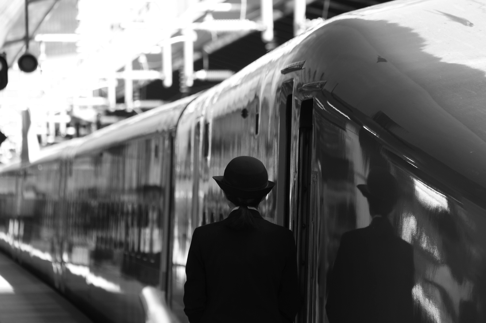

Developed a business habit during the travel within Asian countries and further confirmed during transit from North America.

Due to frequent flight delays and the possibility of lost luggage, followed this unwritten rule

> No Check-In luggage, just what you can carry with you to the final destination.

Transitioning to carry-on-only required a shift in mindset.

It meant leaving the "just-in-case" items at home along with "nice-to-have" on the plane items.

Accepting logistical trade-offs.

If a trip exceeded a week, hotel laundry became a necessity.

My packing philosophy shifted from preventative overpacking to *just-in-time acquisition*:

*If I absolutely need it, I’ll buy it when I get there.*

This constraint sounded like a recipe for deprivation.

But during our Shizuoka séjour days, it proved to be the ultimate travel hack.

### The Inflexible Itinerary

Our business trips to Japan were tightly orchestrated.

Both on the ground and in the air, the itinerary was planned and set with rigor and precision as the Bullet Train (新感線).

Even an ordinary trip resembled a logistical plan for a visiting dignitary:

-   **The Air:** An early morning departure from Salt Lake City (SLC) to Seattle (SEA), followed by a dash to catch Delta Flight DL 167 to Narita Airport (NRT), arriving in the afternoon around 2:00 PM.

-   **The Ground:** A quick transfer to the Narita Express down to Tokyo Station. There, H-san (さん) would meet us at the hotel entrance, holding Shinkansen tickets in hand.

-   **The Train:** Typically, we caught the *Hikari 705*, departing Tokyo at exactly 9:03 AM and arriving into Hamamatsu Station at 10:27 AM.

The evenings were equally packed, often starting with a reunion in Roppongi (六本木) for dinner with H-san’s high school friend.

I don't think H San ever lost a foreign visitor and rarely deviated from his set schedule. I wasn't about to be the first one to break both.

This complex, schedule worked beautifully—as long as there were no surprises.

But international travel, as in life, is full of surprises. Else what will we talk about after the travel.

### The Fork in the Road at SLC

The test of our travel philosophy came during one departure from Salt Lake City. Our morning flight was delayed, immediately jeopardizing the tight connection in Seattle for the Tokyo-bound flight.

Faced with a missed connection, people defaulted to save-thyself mode.

The travel group split, choosing two very different paths to solve the same problem:

1.  **The San Francisco Dash:** Fearing they would miss the only morning flight to Japan, some in our group scrambled to reroute through San Francisco (SFO) on a morning connection, hoping to catch a Tokyo-bound flight from there. They probably spent their morning sprinting through terminals, they were the ones with the travel miles and the business seat to occupy.

2.  **The LAX Detour:** I chose a different path. I decided to wait out the delay in Salt Lake City, booking an evening flight that routed through Los Angeles (LAX) and landed in Narita later that night. Besides, I was not worried about missing out on business seats, since I was travelling on coach tickets.

On paper, my detour was a completely new, untested approach.

It meant arriving late, off-schedule, and missing the initial evening gathering as well as taking the monorail through the south part of Tokyo.

### A Generational Inheritance

That constraint that afforded the ultimate flexibility also works in life as well.

My parents practiced it when they left North Korea as a war refugee.

Whatever they could carry on their body and would fit in the boat.

In my father's case, whatever would fit in his military provided backpack.

They repeated this practice when they boarded the flight from old Gimpo Airport to Anchorage Alaska.

In this case, they took full advantage of checked bags, since they weren't shipping anything to their new home in America.

This practice of determining what is essential versus what is nice to have served my parent's generation well, especially when one had to rely on the strength of one's back.

Now that we have much more than we could ever consume. Perhaps it would be a good test to plan a séjour to a faraway destination and see how many carry-on bags and back packs would be needed

and then ask:

> *Are you controlling what you carry, or is what you carry controlling you?*

