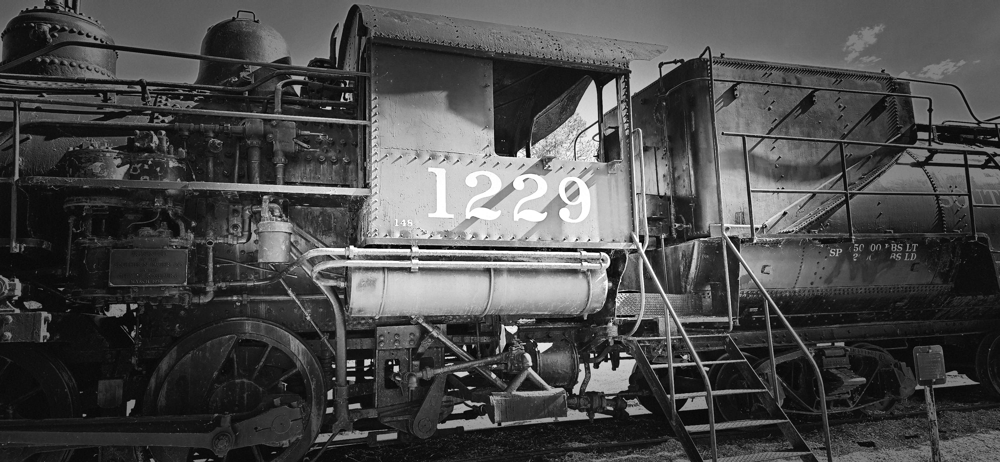

While waiting for the Busan 부산 bound train at Daegu 대구 Station Platform #4, Grandpa was reminded of a recent dream.

In it, a wild boar was chasing down a domesticated pig.

The charging wild boar soon overtook the pig from behind, and the end result wasn't pretty.

As the train approached where he was standing, Grandpa H. boarded the very last passenger car.

However, recalling the dream and instinctively relating it to his current situation, an unsettling feeling took over.

He stood up and started walking toward the front of the train. By the time he stopped moving forward, he had made it to the fifth car from the back.

This turned out to be a crucial, life-saving decision.


A summary of the news from that afternoon reveals just how close he came to tragedy:[^1]

[^1]: <https://namu.wiki/w/%EA%B2%BD%EB%B6%80%EC%84%A0%20%EA%B2%BD%EC%82%B0%20%EC%97%B4%EC%B0%A8%20%EC%B6%94%EB%8F%8C%EC%82%AC%EA%B3%A0>

> On the afternoon of May 14, 1981, at around 4:00 PM, one of the most devastating rail disasters in South Korean history unfolded on the Gyeongbu 경부 Line, between Gomo 고모 and Gyeongsan 경산 stations in Gyeongsangbuk-do 경상북도.
>
> The tragedy began when a forward-bound Bidulgi-ho 비둘기호 train was forced to make an emergency stop after striking a motorcycle that had trespassed onto the tracks.
>
> Just as the train was preparing to resume its journey after handling the initial accident, a fast-approaching Mugunghwa-ho 무궁화호 train misread the signals and failed to stop, slamming violently into the rear of the stationary train.
>
> The impact was catastrophic; the Mugunghwa 무궁화호 locomotive plowed straight into the rear passenger cars of the Bidulgi-ho 비둘기호 , crushing them into tangled sheets of metal. This horrific collision ultimately claimed 55 lives and left over 200 injured, leaving a deeply painful scar on the nation's history and serving as a stark, enduring reminder of the tragic cost of signaling errors and safety oversights.

From the time Grandpa boarded the train to the location of the accident was only about five miles.

Considering the speed of the train, he had just minutes to act on his intuition. By moving out of those final four cars and into the fifth, he narrowly escaped severe injury—and death.

```{r}
#| echo: false
#| warning: false
#| message: false

library(leaflet)

stations <- data.frame(
  Station = c(
    "Daegu (대구역)",
    "Gomo (고모역)",
    "Gyeongsan (경산역)"
  ),
  Latitude = c(
    35.87609565676222, 
    35.85801593619306, 
    35.82031392640734 
  ),
  Longitude = c(
    128.59614203586966,
    128.67788261176096,
    128.725655974802
  )
)

leaflet(stations) |>
  addProviderTiles("CartoDB.Positron") |>
  addCircleMarkers(
    lng = ~Longitude,
    lat = ~Latitude,
    radius = 7,
    color = "blue",
    fillColor = "red",
    fillOpacity = 0.8,
    popup = ~paste0(
      "<b>", Station, "</b>"
    )
  ) |>
  fitBounds(
    lng1 = min(stations$Longitude),
    lat1 = min(stations$Latitude),
    lng2 = max(stations$Longitude),
    lat2 = max(stations$Latitude)
  )
```



------------------------------------------------------------------------

It makes you wonder about the quiet prompts we receive in life.

A single, seemingly random decision to get up and change seats—driven by nothing more than the memory of a strange dream—was the exact boundary between a normal Tuesday afternoon and becoming a statistic in one of the country's worst transit disasters.

**Sometimes, a different outcome is simply the result of recognizing a pattern, and matching it with the promptings and teachings we've received.**

For Grandpa H, his survival was a matter of minutes, five miles, and listening to a prompt that told him to move.


------------------------------------------------------------------------

News Summary in Korean

-   **사고 일시**: **1981년 5월 14일** 오후 4시경 \[[1](https://namu.wiki/w/%EA%B2%BD%EB%B6%80%EC%84%A0%20%EA%B2%BD%EC%82%B0%20%EC%97%B4%EC%B0%A8%20%EC%B6%94%EB%8F%8C%EC%82%AC%EA%B3%A0)\]

-   **사고 장소**: 경상북도 경산군 고모역\~경산역 사이 경부선 하행선 선로 \[[1](https://namu.wiki/w/%EA%B2%BD%EB%B6%80%EC%84%A0%20%EA%B2%BD%EC%82%B0%EC%97%AD~%EA%B3%A0%EB%AA%A8%EC%97%AD%20%EC%97%B4%EC%B0%A8%20%EC%B6%94%EB%8F%8C%EC%82%AC%EA%B3%A0?uuid=308e3357-2102-4b8a-a176-0227a6daff6f)\]

-   **사고 경위**:

    1.  앞서 달리던 대구발 부산행 **비둘기호 열차가 선로에 무단 진입한 오토바이를 치는 사고**가 발생해 비상 정차했습니다.

    2.  사후 수습을 마친 비둘기호가 다시 출발하려는 순간, 뒤이어 오던 서울발 부산행 **무궁화호 열차가 신호를 오인하고 멈추지 못해 비둘기호의 뒷편을 강력하게 추돌**했습니다. \[, [2](https://namu.wiki/w/%EA%B2%BD%EB%B6%80%EC%84%A0%20%EA%B2%BD%EC%82%B0%EC%97%AD~%EA%B3%A0%EB%AA%A8%EC%97%AD%20%EC%97%B4%EC%B0%A8%20%EC%B6%94%EB%8F%8C%EC%82%AC%EA%B3%A0?uuid=308e3357-2102-4b8a-a176-0227a6daff6f)\]

-   **사고 피해**: 무궁화호 기관차가 비둘기호 후미 객차들을 덮치면서 처참하게 종잇장처럼 구겨져, **사망자 55명, 부상자 200여 명**이 발생하는 참사로 기록되었습니다
