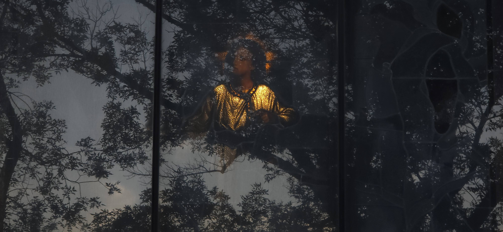

My parents were born nearly a century ago, and their lives were a blend of the contemporary and the deeply traditional.

Over nine decades, their experiences spanned two continents, a clash of multiple ideologies (colonialism, communism, civil wars, dictatorship, and democracy), and three languages.

Yet, for all their global experiences, one of the most enduring traits of their life was how they communicated—or rather, how they chose never to offer praise.

They rarely expressed gratitude or gave compliments to one another, even in private, as if putting their exact feelings into words might somehow cheapen them.

But we always knew the appreciation was there.

When I think of their style of love, their relationship mirrored Golde and Tevye from *Fiddler on the Roof*.

Theirs was an arranged marriage, orchestrated by older family members who judged their characters and decided they were complementary.

Just like the iconic couple on stage, their marriage was built not on romance, but on shared responsibility, mutual respect developed over decades, a fierce commitment to family and faith, and a quiet, enduring love.

It was this profound sense of dynamic balance that lingered in my mind after their passing, when I read a declaration from the Vatican. A passage from the Holy See Press Office contained these words:

> Another prominent aspect of gender theory is that it intends to deny the greatest possible difference that exists between living beings: sexual difference. This foundational difference is not only the greatest imaginable difference but is also the most beautiful and most powerful of them. In the male-female couple, this difference achieves the most marvelous of reciprocities. It thus becomes the source of that miracle that never ceases to surprise us: the arrival of new human beings in the world.

— Declaration of the Dicastery for the Doctrine of the Faith “Dignitas Infinita” on Human Dignity, 08.04.2024^[https://press.vatican.va/content/salastampa/en/bollettino/pubblico/2024/04/08/240408c.html]

My parents did not agree on all matters, but they were always helpful and supportive on critical matters. They lived out that marvelous reciprocity every day, ultimately fulfilling the main purpose of their mission on this earth.

In the words of that Declaration:

> This foundational difference is not only the greatest imaginable difference but is also the most beautiful and most powerful of them.

Thank you, Mom and Dad, for your complementary, powerful—and complimentary, beautiful—life.

