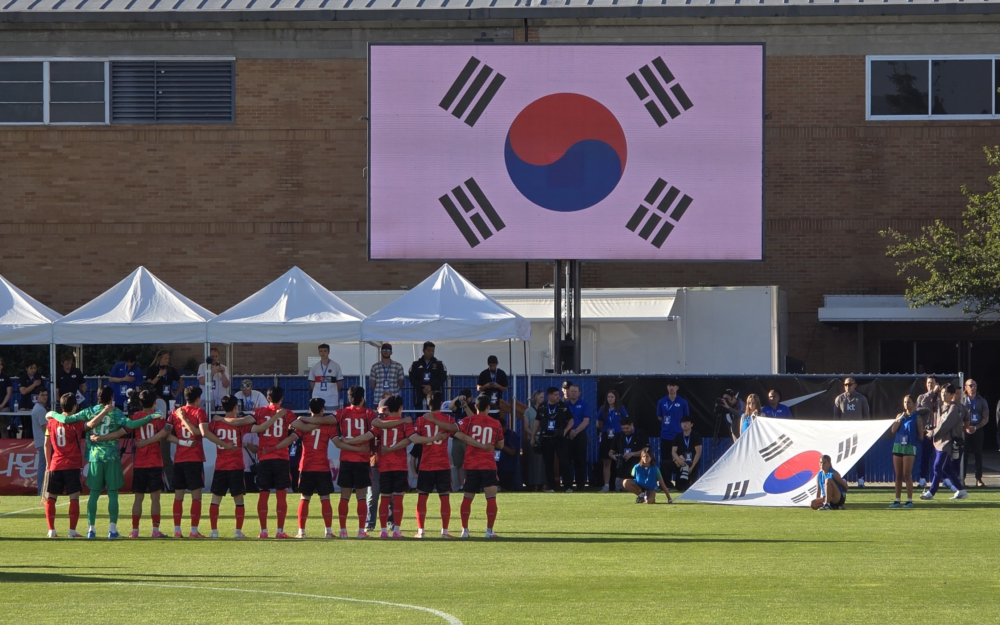

There is no moment in sports quite like the singing of the national anthem.

Whether it’s a quadrennial tournament or an international match, the scene is the same: two teams standing poised, hopeful, and seemingly invincible.

For a brief moment, they embody the unity, purpose, and ideals of their respective nations and the sportsmanship of the game.

But when the game begins, that pristine image vanishes, replaced by a win-at-all-costs strategy and its associated shortcomings.

I was reminded of this delicate balance between worldly division and loyalty and higher unity when an international visitor from Japan sang a traditional Korean song.

------------------------------------------------------------------------

Once, a representative from Tokyo, Japan came to Taegu, Korea.

At the time, our area was designated as the North Asia region, encompassing Korea, Japan, and the islands of Micronesia, with its headquarters in Tokyo.

Because we were living 300 kilometers southeast of Seoul, we rarely saw international visitors.

On this particular visit, during the Saturday evening session, the speaker opened up about his family history, specifically mentioning that his uncle was Korean.

He told us that his uncle would often sing a Korean song, and then he did something unexpected: he asked if he could sing that song to us, and invited the congregation to join in the singing.

보리밭 사잇길로 걸어가면 뉘 부르는 소리가 있어 발을 멈춘다. 옛 생각이 외로워 휘파람 불면 고운 노래 귓가에 들려온다. 돌아보면 아무도 뵈이지 않고 저녁노을 빈 하늘만 눈에 차누나.

> *As I walk the path between the swaying barley,* *A distant voice seems softly calling me;* *I pause and listen.* *When lonely memories stir, I whistle to the wind,* *And a gentle song comes drifting to my ear.* *I turn around—there is no one there.* *Only the empty evening sky,* *Filled with the glow of the setting sun.*

The speaker stated that he didn't realize dual meaning of words when he was young, but the lyrics of *The Barley Field* (보리밭) described more than just a longing for a lost home or a bygone memory.

They pointed to a higher sphere—a deeper, universal home that we all aspire to.

------------------------------------------------------------------------

Decades later, a modern algorithm directed me to a video of young people singing on a popular streaming app.

The group consisted of thirty individuals from seven western states of the United States, as well as the Philippines, and native Koreans.

All serving as representatives of Christ in Korea, this group sang that exact same song, *The Barley Field* ($보리밭$).[^1]

[^1]: https://www.youtube.com/watch?v=k86JOTmhaJI&t=207s

Coming from them, those same lyrics carried a higher, more nuanced message.\

It was a reaffirming message that they possessed the gospel teachings capable of not only taking people back to their true home, but uniting them with their loved ones once more.\

As they sang beautifully as a unit, I felt a deep reassurance that these sacred ideals will not only continue, but grow.

The players who sang their national anthems tried their utmost to represent the ideals of their nations and their sport.

Likewise, these young singers—who may not yet fully grasp the deep cultural weight of these Korean words or their long-term impact—stood and testified through music.

Using their talents, and through their voices, they revealed the true meaning of finding our way home, and the joy of bringing others along with us.

Thank you to the young people of today. Bravo.

