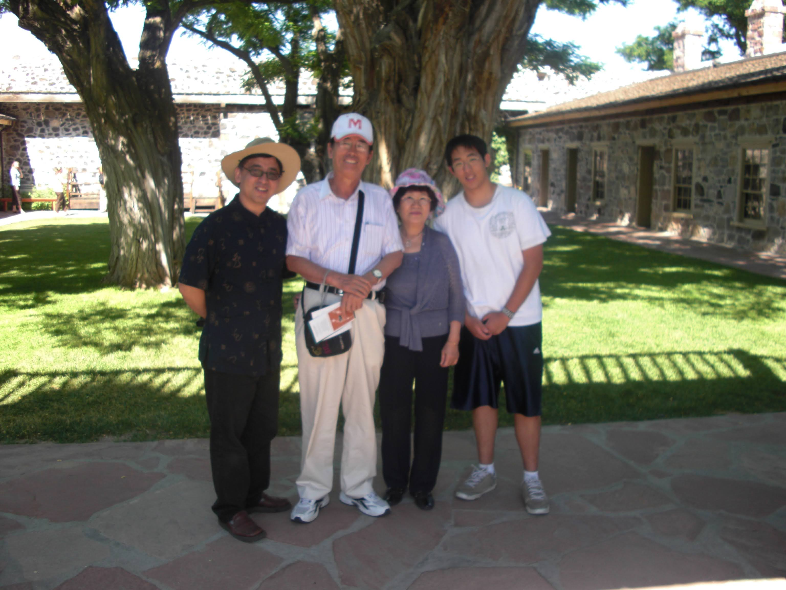
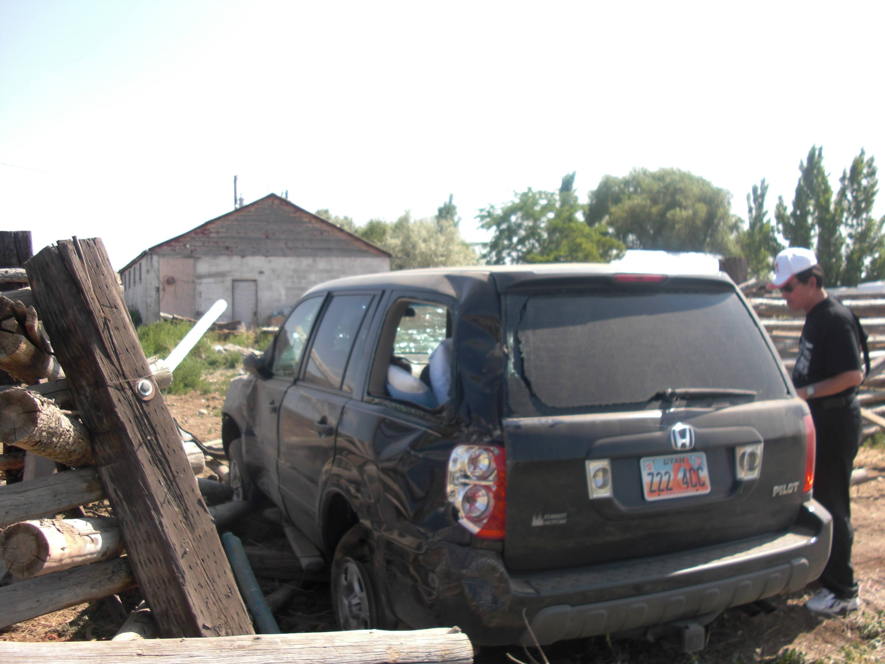
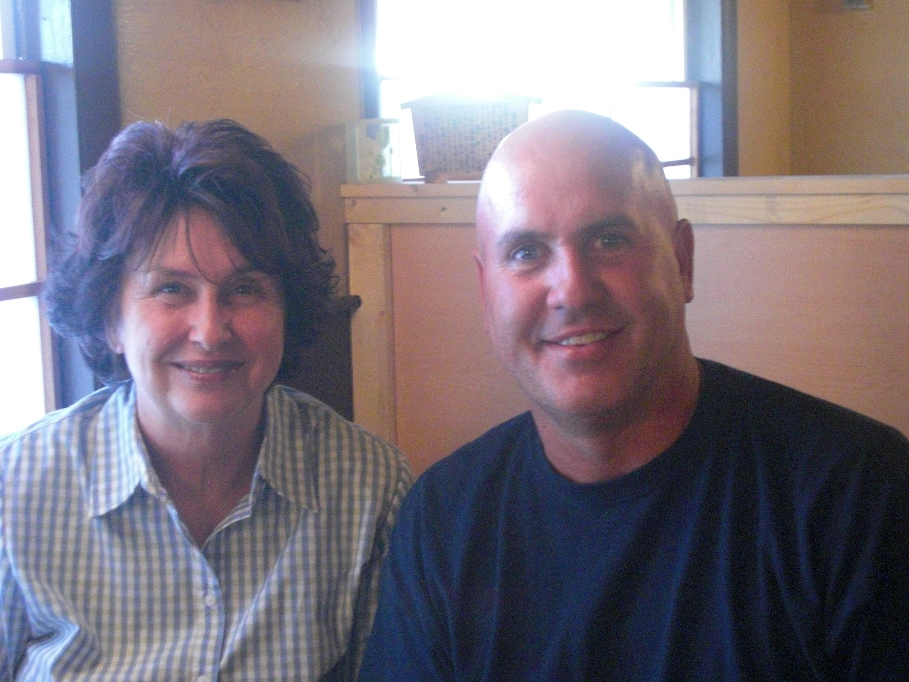

Our destination was Vernal, but we never made it.

We only got as far as Myton, a small town about forty miles short of our goal.

Six of us were traveling in the Honda Pilot that day, all related to Sister K, her mother, her younger sister, her maternal grandmother, and her aunt’s in-laws.

We had started the drive from Provo.

By the time I had driven about a hundred miles of undivided highway, Sister K's aunt offered to take over the wheel.

Feeling a bit tired, I accepted the offer and slid into the passenger seat.

Not even fifteen minutes later, I was just beginning to drift off when I sensed something was wrong.

The car was no longer on the asphalt; we were going sideways, hurtling toward a home off the side of the road.

The aunt had fallen asleep at the wheel.

In an effort to straighten the vehicle, she over corrected, sending the heavy SUV veering off the road and directly toward the sturdy wooden fences that lined the shoulder.

In that moment, as we headed toward an inevitable, high-speed collision with a fixed object, time seemed to slow down.

Even as the car rushed toward the impact, I felt an unmistakable presence—as though something invisible was actively guiding us through the chaos and steering us to safety.

------------------------------------------------------------------------

Sister K's aunt’s in-laws were visiting us from Korea.

It was July of 2008, and because she was busy running her business, she asked if I could show them some of the sights around the state.

We decided on Zion National Park, about 234 miles to the south.

Living in Utah conditioned us for long road trips, so I recruited my seventeen-year-old to help me split the driving.

Along the way, we stopped to stretch our legs at Cove Fort. It was an entirely uneventful trip—exactly the way a driver likes it.

A few days later, Sister K's aunt chose a different destination: Vernal.

Though it was only about 150 miles to the northeast, the route required navigating a two-lane, undivided highway, which meant the drive would actually take longer.

Initially, we planned to take our Toyota Sienna minivan. But at the very last minute, we changed our minds and loaded everyone into our heavier Honda Pilot instead.

That seemingly ordinary decision to switch vehicles likely prevented a catastrophic trip to the hospital.

------------------------------------------------------------------------

The SUV met its death that day, but it fulfilled its final purpose: protecting its occupants from harm.

The wooden fence cushioned the impact, and though the vehicle was totaled, every single person inside walked away without an injury.

It was a miracle, considering we had been traveling at highway speeds just moments before.

I believe the way the car drifted—much like a controlled slide in a Mario Kart game—not only slowed our momentum but also angled the impact to minimize the force of the crash.

There were unseen forces guiding us that afternoon.

Everyone in that car was over sixty years old except for me, and Sister K’s grandmother was nearly eighty.

Any direct, on-road collision would have meant a trip to the emergency room, or worse.

Instead, the property owners came out to the road, assessed the damage, and warmly ushered us all inside their home.

After exchanging pleasantries and addresses, we formed a plan: the owners, the Jensens, would drive us all the way back to Provo.

Looking back at that day eighteen years later, I am reminded of the famous words of pilot Chuck Yeager:

> *"If you can walk away from a landing, it's a good landing. If you use the airplane the next day, it's an outstanding landing."*

Of the six of us in the car that day, only two are still walking this earth, and we are both using a different set of wheels.

As for Vernal, it is a destination that has lost its allure; we never did make it there, but we all made it home that day.

---

우리의 목적지는 버널(Vernal)이었지만, 우리는 그곳에 결코 도착하지 못했다.

우리가 간 곳은 목적지를 고작 40마일 앞둔 마이턴(Myton)이라는 작은 마을까지였다. 그날 혼다 파일럿(Honda Pilot) 차 안에는 여섯 명이 타고 있었는데, 모두 K 자매의 가족들이었다. K 자매와 그녀의 어머니, 여동생, 외할머니, 그리고 이모의 사돈 어르신들이었다.

우리는 프로보(Provo)에서 출발했다. 중앙분리대가 없는 고속도로를 100마일쯤 달렸을 때, K 자매의 이모님이 교대 운전을 제안하셨다. 조금 피곤함을 느끼던 터라 나는 제안을 받아들이고 조수석으로 자리를 옮겼다.

채 15분도 지나지 않아, 막 잠에 빠져들려던 찰나 무언가 잘못되었다는 느낌이 엄습했다. 차는 이미 아스팔트 도로를 벗어나 옆으로 미끄러지며 도로변의 한 주택을 향해 돌진하고 있었다. 

이모님이 운전대를 잡은 채 잠이 드신 것이다. 갑작스러운 상황에 차를 바로잡으려던 이모님은 핸들을 과하게 꺾으셨고, 무거운 SUV는 도로를 벗어나 길가에 길게 세워진 튼튼한 나무 울타리를 향해 곧장 곤두박질쳤다. 움직이지 않는 거대한 장애물과의 피할 수 없는 고속 충돌을 앞둔 그 순간, 시간은 마치 멈춘 것처럼 느리게 흘렀다.

차가 충돌을 향해 무서운 속도로 돌진하는 와중에도, 나는 무언가 보이지 않는 존재가 이 혼돈 속에서 우리를 안전한 곳으로 인도하고 있다는 분명한 느낌을 받았다.

---

K 자매 이모님의 사돈 어르신들이 한국에서 우리를 방문하셨다. 때는 2009년 7월이었고, 이모님은 비즈니스로 바쁘셨기에 내게 그분들께 유타주의 멋진 곳들을 구경시켜 줄 수 있느냐고 부탁하셨다. 

우리는 남쪽으로 234마일 떨어진 자이언 국립공원(Zion National Park)에 가기로 했다. 유타주에 산다는 것은 장거리 로드트립을 일상으로 받아들여야 함을 의미한다. 그래서 나는 운전을 나누어 하기 위해 당시 열일곱 살이던 아들을 데리고 나섰다. 가는 길에 코브 포트(Cove Fort)에 들러 가볍게 몸을 풀기도 했다. 그 여행은 운전자들이 가장 좋아하는, 아주 평온하고 아무 일도 없는 여정이었다.

그리고 며칠 뒤, 이모님은 다음 목적지로 버널을 선택하셨다.

그곳은 북동쪽으로 150마일 정도밖에 떨어져 있지 않았지만, 중앙분리가 없는 왕복 2차선 도로를 지나야 해서 실제 운전 시간은 훨씬 더 길었다. 처음에는 우리의 도요타 시에나(Toyota Sienna) 미니밴을 타고 갈 계획이었다. 하지만 정말 마지막 순간에 우리는 생각을 바꾸어, 더 튼튼하고 무거운 혼다 파일럿에 모두 나누어 탔다. 

차를 바꾸겠다는 그 사소해 보이던 결정이, 결과적으로 우리 모두가 병원 신세를 지는 비극을 막아준 셈이었다.

---

그날 우리 SUV는 수명을 다했지만, '탑승자들을 안전하게 보호한다'는 마지막 사명은 완벽히 완수했다. 

나무 울타리가 충돌의 충격을 완화해 주었고, 차는 완전히 폐차되었지만 다행히 차에 탄 사람 중 단 한 명도 다치지 않았다. 불과 몇 초 전까지만 해도 고속도로 속도로 달리고 있었다는 점을 생각하면 그야말로 기적이었다.

나는 그날 우리 차가 미끄러지던 모습이 마치 비디오 게임 '마리오 카트'에서 컨트롤하는 드리프트와 같았다고 생각한다. 그 드리프트 덕분에 차의 속도가 줄었을 뿐만 아니라, 충격을 최소화할 수 있는 비스듬한 각도로 울타리를 들이받을 수 있었다. 그날 오후, 분명 보이지 않는 힘이 우리를 도왔다. 차 안에서 나를 제외한 모든 이들은 60세가 넘은 고령이었고, K 자매의 외할머니는 여든을 바라보고 계셨다. 도로 위에서 조금이라도 더 거친 충돌이 일어났다면 고스란히 응급실 행이었을 것이고, 혹은 그보다 더 끔찍한 결과로 이어졌을 것이다.

대신 울타리가 있던 집의 주인들이 밖으로 나와 상황을 살피더니, 우리 모두를 집 안으로 따뜻하게 맞아들여 주었다. 가벼운 인사와 주소를 주고받은 뒤, 우리는 계획을 세웠다. 집주인이었던 젠슨(Jensen) 부부가 우리를 프로보까지 다시 데려다주기로 한 것이다.

18년이 지난 지금 그날을 돌이켜보면, 전설적인 파일럿 척 예거(Chuck Yeager)의 유명한 한마디가 떠오른다. 

> *"살아서 걸어 나올 수 있는 착륙이라면 좋은 착륙이다. 그리고 다음 날에도 그 비행기를 탈 수 있다면 그것은 훌륭한 착륙이다."*

그날 차에 타고 있던 여섯 명 중 지금까지 이 땅을 걷고 있는 사람은 단 두 명뿐이다. 우리에게 버널은 완전히 매력을 잃어버린 목적지가 되었다. 우리는 비록 버널에는 도착하지 못했지만, 그날 우리 모두는 무사히 집으로 돌아왔다.

