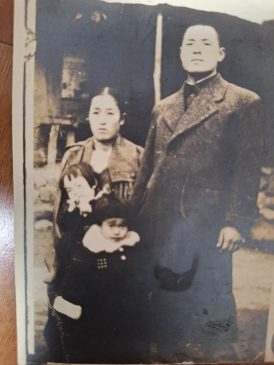
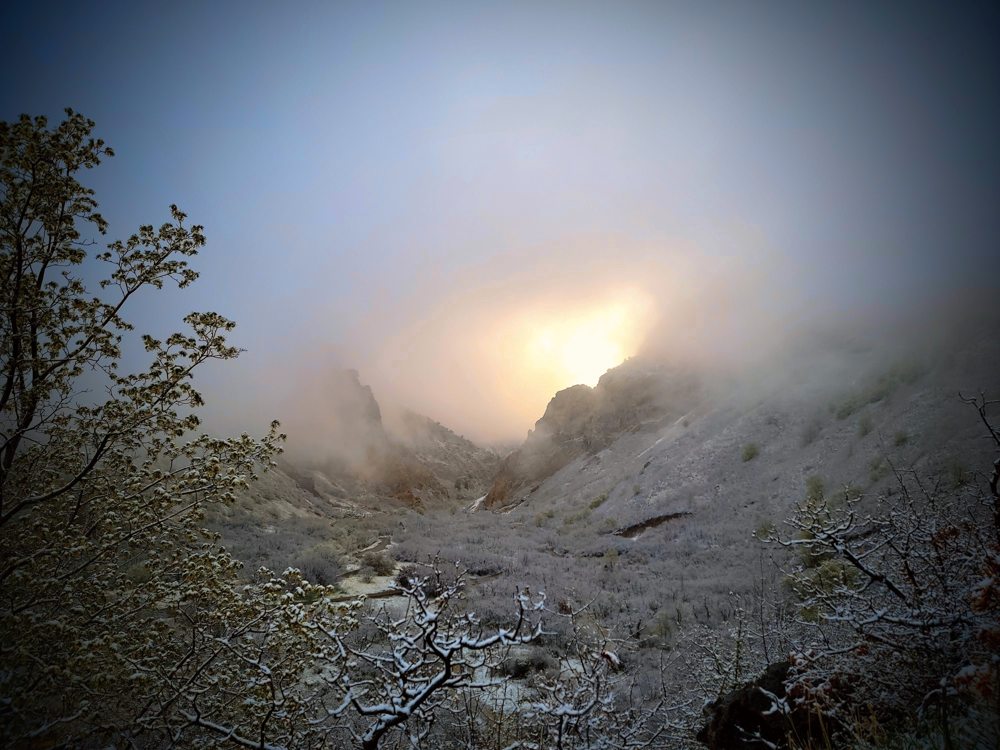

Whether it is entirely true or not, I am not certain, but this is the story I remember hearing from my mother, Hwang Young-ja (황영자), and my maternal grandmother (성순희).

When my mother was just a little girl, my grandfather Hwang Gyu-hyeon (황규현) was a larger-than-life figure—both figuratively and literally.

He was exceptionally tall, incredibly handsome, and kept his hair styled in a sharp, modern cut.

Traveling back and forth to Japan frequently on business, he would bring home the latest fashionable items.

Thanks to him, his children wore Western-style shoes instead of the common black rubber shoes of the era. 

---\

My mother said that when he walked down the dirt paths of our rural village wearing his long, flowing trench coat, he looked like a visitor from another planet.

In those days, everyone else wore traditional, modified hanbok (한복), stepping around in black rubber shoes with their hair tied back.

But my grandfather was different. He carried a brilliant, unmistakable aura.

My grandmother was actually two years older than him. Yet, because her husband was so commanding, capable, and highly educated, she always walked respectfully about ten paces behind him in public. 

My mother was their firstborn daughter, and my grandfather favored her. Because she had been frail since childhood—suffering from severe fevers and joint inflammation—my grandfather used his wealth to hire a private, live-in nurse just to tend to her.

Having tasted the modern world outside of Korea, he used to tell her,

> "Since you are not strong, you must be educated if you want to marry well later. I am going to send you to study abroad in Japan."

But then, the war came.

---

Among their relatives, there was a particularly bright young nephew. When the North Korean communist forces swept down into our village, they began recruiting local informants.

This nephew volunteered.

He became deeply indoctrinated by communist ideology, and despite his young age, he would gather the villagers together to teach them songs praising the communist party.

Even worse, he began snitching on his neighbors, pointing out anyone he deemed to be enemy sympathizers. Through these actions, he earned the bitter resentment of the entire village.

As the tide of the war turned—with the UN, America, and South Korean forces pushing back north—the suppressed rage of the townspeople boiled over.

Many of them had lost family members who had been captured and executed by the communists. One night, an angry mob set out to hunt down those who had collaborated.

Suddenly, someone began banging on my grandmother’s door. A neighbor was shouting from the street:

> \*"Your nephew has been caught! They are taking him away!"\*

If that neighbor hadn't come to our door that night, my grandfather would never have run outside. 

As my grandfather leaped up to get dressed, my grandmother desperately grabbed his legs, begging him not to go. She cried out,

> "There are four young children in this house! If you go out there, you will die!"

But my grandfather rebuked her.

> "A member of our own family is about to be killed. I have to go stop them and bring him back."

And with that, he ran out into the dark.

He caught up to the mob, but it wasn't just one or two people being targeted.

A group of collaborators had been dragged to a clearing, and the mob had lost all control. They cornered the captives and began stoning them.

Unable to bear the anxiety of not knowing, my grandmother eventually ran out into the night to search for him.

When she arrived at the site, the ground was already slick with the blood of the fallen. Before she could search any further, a local man spotted her and pulled her aside. 

> \*"You cannot stay here,"\* he whispered urgently. \*"You must run away immediately. Once people taste blood like this, they lose their minds. They might come back to your house next and kill your entire family. Go now!"\*

My grandmother rushed back to the house. She strapped her youngest son—my uncle, who was only two years old at the time—onto her back.

Grabbing the hands of her other three children—my mother, 12, her sister, 10, and her brother, 6—she fled into the darkness.

They walked through the night, weeping all the way, fleeing toward her family home in Seosan (서산). 

That night was the last time Grandma Seong ever saw her husband. 

She was thirty-two years old and he was thirty.

—

별에서 온 사람

정말인지 모르겠지만 하여튼 우리 엄마 황영자 씨와 외할머니에게 들은 기억을 바탕으로 한 이야기입니다. 우리 외할아버지의 이름은 황규현, 외할머니의 이름은 성순희 씨였습니다.

우리 엄마가 아주 어렸을 때, 외할아버지는 비유적으로나 실제적으로나 그야말로 범상치 않은 존재였습니다. 키가 엄청나게 크고 아주 잘생기셨으며, 머리는 늘 현대식으로 단정하게 이발하셨습니다. 일본으로 수시로 출장을 다니시던 외할아버지는 올 때마다 가장 세련된 물건들을 사 오곤 하셨습니다. 덕분에 외할아버지의 아이들은 그 시절 흔하던 검정 고무신 대신 서양식 구두를 신고 다녔습니다.

엄마의 기억 속 외할아버지는 한복을 입고 고무신을 신은 채 머리를 땋고 다니던 시골 논두렁길에서, 긴 바바리코트를 자락을 휘날리며 걸어가던 분이었습니다. 그 모습이 마치 다른 별에서 온 사람 같았다고 합니다. 주위 사람들과는 전혀 다른, 말 그대로 눈부신 아우라가 있는 분이었습니다.

외할머니는 외할아버지보다 두 살 연상이었습니다. 하지만 남편이 워낙 똑똑하고 유능하며 아는 것이 많았기에, 외할머니는 늘 남편의 뒤를 서너 발자국 뒤따르며 정중히 예의를 갖추어 걸었습니다.

외할아버지는 첫째 딸인 우리 엄마를 유독 아끼고 귀하게 여기셨습니다. 엄마가 어릴 때부터 몸이 약해 늘 열이 나고 관절염으로 아파하자, 외할아버지는 아낌없이 돈을 써서 집에 전속 간호사까지 두고 돌보게 했습니다. 이미 일본을 오가며 넓은 세상의 물을 맛본 외할아버지는 약한 큰딸에게 늘 이렇게 말씀하셨다고 합니다. "몸이 약할수록 공부를 많이 해야 나중에 시집도 잘 갈 수 있다. 나중에 일본으로 유학 보내주마."

하지만 행복했던 시간도 잠시, 전쟁이 터졌습니다.

친척 중에 유독 영리한 조카가 한 명 있었습니다. 북한 공산당이 동네로 밀고 들어왔을 때, 그들은 동네에서 활동할 밀고자를 모으기 시작했습니다. 이 조카가 자원하여 앞장섰습니다. 어린 나이였음에도 공산당 사상에 깊이 물든 그는 동네 사람들을 모아놓고 인민공화국을 찬양하는 노래를 가르쳤습니다. 심지어 마음에 안 들거나 사상이 의심스러운 이웃들을 고발하고 고자질하기까지 했습니다. 자연스레 온 동네 사람들의 깊은 원망과 미움을 사게 되었습니다.

유엔군과 미군, 국군이 위로 치고 올라오면서 전세가 역전되자, 그동안 공산당 때문에 억눌려 지내며 가족을 잃었던 동네 사람들의 분노가 한꺼번에 폭발했습니다. 어느 날 밤, 성난 군중은 공산당에 협조했던 부역자들을 잡기 위해 몰려나왔습니다.

갑자기 우리 외할머니네 집 방문을 사정없이 두드리는 소리가 들렸습니다. 동네 사람이 밖에서 다급하게 외쳤습니다. "당신 집 조카가 붙잡혀 가고 있소! 빨리 가보시오!"

그날 밤 그 이웃이 찾아와 그 소식을 전하지만 않았어도, 외할아버지는 밖으로 나가지 않았을 것입니다.

외할아버지가 벌떡 일어나 옷을 갈아입자, 외할머니는 남편의 다리를 붙잡고 제발 나가지 말라며 울부짖었습니다. "집안에 아직 어린 자식들이 네 명이나 꼬물거리고 있어요! 지금 나가면 죽소!"

하지만 외할아버지는 단호하게 아내를 타일렀습니다. "우리 집안 식구가 죽게 생겼는데 어떻게 모른 척한단 말이냐. 내 가서 말리고 데려와야겠다."

그 말을 마지막으로 외할아버지는 캄캄한 어둠 속으로 뛰쳐나갔습니다.

외할아버지가 사람들이 모여 있는 곳에 도착했을 때, 그곳은 이미 이성을 잃은 아수라장이었습니다. 잡혀 온 부역자들뿐만 아니라 그들을 말리러 온 부모와 가족들까지 한데 엉켜 성난 군중들에게 무자비하게 돌매질을 당하고 있었습니다.

불안해서 견딜 수 없었던 외할머니도 결국 밤중에 남편을 찾아 밖으로 뛰쳐나갔습니다. 현장에 도착했을 때, 땅바닥은 이미 쓰러진 사람들의 피로 붉게 물들어 있었습니다. 외할머니가 남편을 채 찾기도 전에, 한 동네 남자가 외할머니를 발견하고 다급하게 끌어당겼습니다.

"여기 있으면 큰일 나요, 빨리 도망가시오! 사람들이 한번 피를 보면 눈이 뒤집혀서 남은 가족들까지 찾아가 해칠지도 모르니 얼른 피하시오!"

외할머니는 정신없이 집으로 뛰어 돌아왔습니다. 그리고 당시 겨우 두 살이던 막내 외삼촌을 등에 업고, 나머지 세 아이—우리 엄마와 이모, 삼촌—의 손을 꼭 쥔 채 칠흑 같은 어둠 속으로 도망쳤습니다.

겨우 몇 가지 짐만 급히 챙겨 든 채, 아이들과 함께 밤새 울며 걷고 또 걸어 친정이 있는 충남 서산으로 피난을 떠났습니다.

그 비극적인 밤은 외할머니가 남편의 마지막 모습을 본 밤이 되었습니다. 그때 외할머니의 나이는 서른두 살이었습니다.

\
\
\
