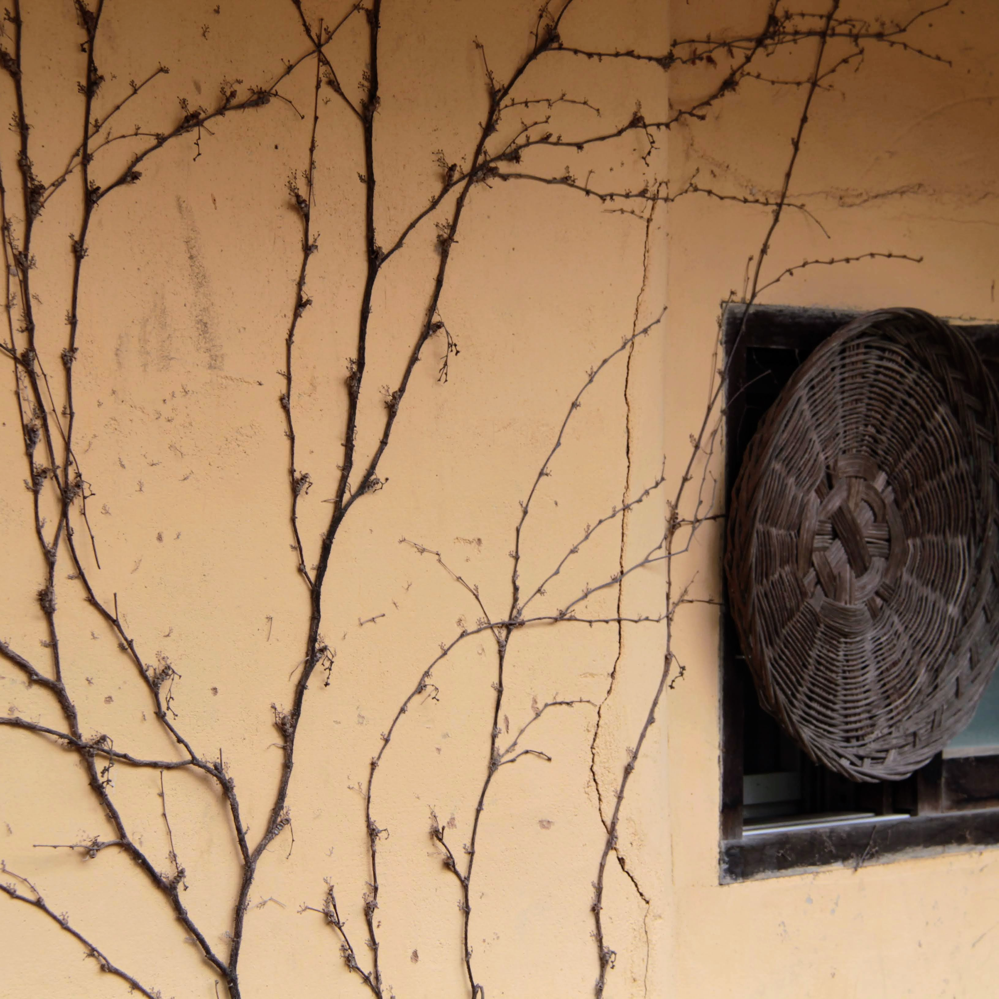
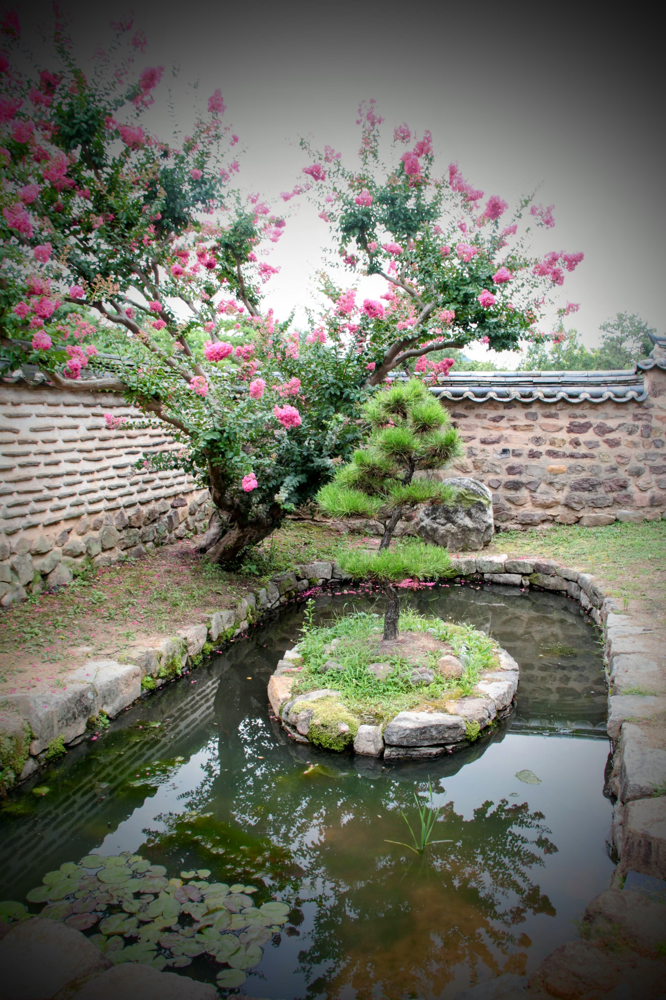

I seldom talk to my sisters.

It isn't a matter of distance or difficulty—my sisters live in the United States, separated by only two time zones.

I could, if I chose to, be updated on their lives on a regular basis. I simply don't see the need to check in constantly.

Sister K, on the other hand, is in daily communication with her female siblings.

Even with a fifteen-hour time difference stretching across to Korea and Japan, she stays effortlessly updated on every detail of their daily lives.

I’m reminded of this dynamic during my daily hikes in the canyons.

Along with the early morning bird calls, one sound is entirely inevitable: the voices of women hiking together in groups of two, three, or sometimes half a dozen.

Their voices blend into a lively canyon chorus—a rich, continuous hum of connection that, to someone like me, sounds almost like a language of its own.

---

For me, a productive day has a very specific signature: a sense of accomplishment when I take in facts, figures, and trends, synthesize the information, and formulate a hypothesis.

If I can gather the necessary data and arrive at a statistically significant conclusion, my day feels complete and fulfilling.

My mind is wired for order, logic, and clear conclusions.

However, engaging in a conversation with Sister K requires an entirely different operating system.

When she catches me up on the family news, I am suddenly required to keep a dozen different channels open simultaneously.

I have to track an overwhelming cast of characters, unravel subtle and differing motives, and navigate unpredictable plot twists—all of which feel complex enough to spawn their own multi-season K-Drama.

My analytical, limited-bandwidth brain quickly hits capacity trying to follow the storyline.

Yet Sister K manages it all effortlessly, keeping every thread perfectly organized without missing a beat.

---

After thirty-seven years together and raising four children, my once-rigid stance has softened. In our regular discussions,

Sister K and I still lean into our preferred styles—my analytical data-gathering versus her sprawling relational web.

Yet we’ve grown far more malleable and open to trade-offs than we were even a decade ago.

It is no longer a question of which approach is better.

Rather, it’s about whether blending our perspectives yields a richer, more satisfying understanding than either of us could reach alone.

There is, however, a subtle hint as to which approach is harder to master in this age of artificial intelligence.

Large Language Models have already replicated and bridged nearly all of human knowledge and historical facts. But I doubt current computing methods will ever capture Sister K’s fluid, intuitive approach to daily living.

Perhaps when quantum computing becomes commonplace, a machine might effortlessly track dozens of emotional threads, family updates, and unspoken feelings all at once.

I could receive a clean, automated report every morning without any effort on my part.

But that would be contrary to life's purpose.

Automated updates mean no interaction with Sister K—and learning to walk in her world, effort and all, is the main purpose of the journey.

