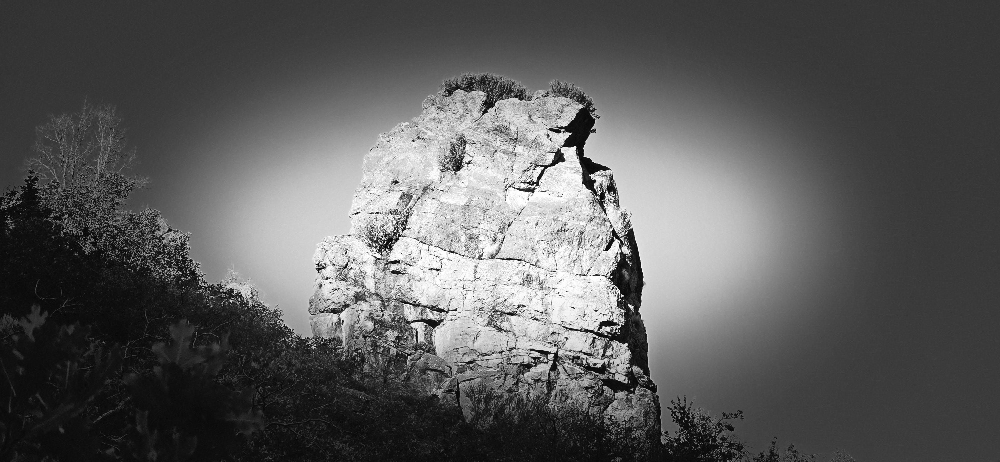
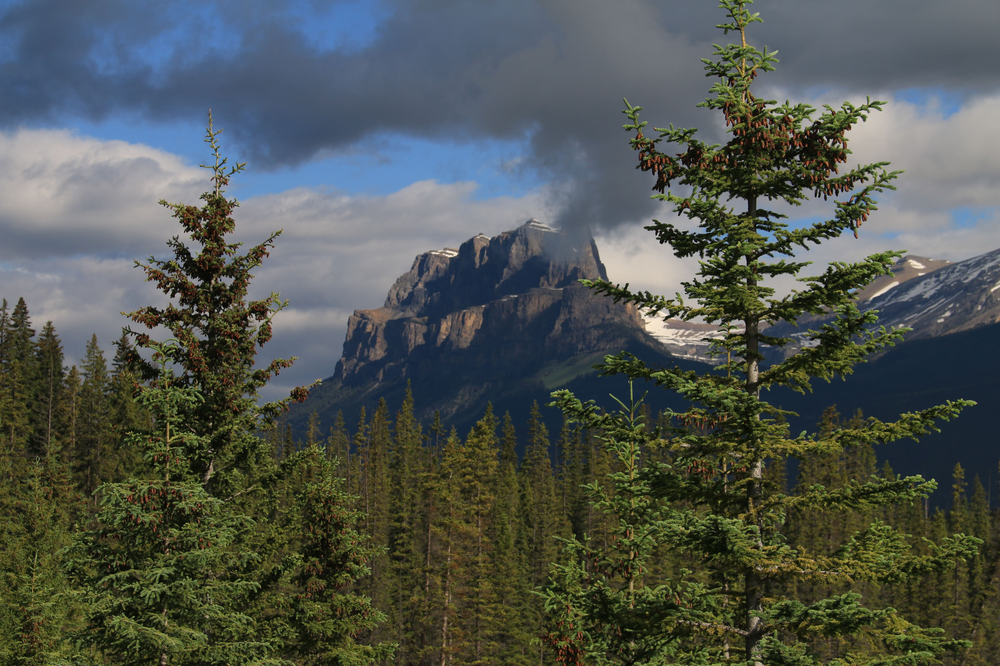

Soon, Sister K and I will celebrate one of the most significant milestones in a person’s life: the anniversary of our marriage and the many decades we have shared together.

If measured against the world’s standards, I have to admit I haven't always been a role model.

I often used demands of life as an alibi.

On our very first anniversary, we were technically in the same country—Korea—but due to my poor planning, we spent the day in separate cities, 100 kilometers apart.

------------------------------------------------------------------------

And yet, after thirty-seven years and lifetime of experiences, I have thought about *why* we were married in the first place.

I want to recount how our story began—how two people with a different background and a low probability of meeting, managed to come together and build a life.

I offer this memory with one proviso: **the official account of all events remains solely with Sister K.**



------------------------------------------------------------------------

When our neighborhood group are together, the conversation often turns to a familiar question:

*"So, how did you two meet?"*

Invariably, the answer is: *"While we were attending BYU."*

Our story starts similarly, with a few distinct details of its own.

Four weeks after completing my mission in Los Angeles, California, I found myself in Provo, Utah, starting classes at BYU.

Eager to stay connected to my Korean heritage, I began making the weekly trip up to Salt Lake City to attend a local Korean Branch.

We met in the historic Nibley Park Ward[^1] building near 7th East and I-80—a meetinghouse dedicated back in 1925.

[^1]: https://ldspioneerarchitecture.blogspot.com/2016/11/nibley-park-ward.html

```{r}
#| label: nibley-park-map
#| echo: false
#| warning: false
#| message: false
#| fig-width: 10
#| fig-height: 7

library(leaflet)

# Location coordinates
latitude <- 40.71743181928917
longitude <- -111.87400442634298

# Create interactive map
leaflet() |>
  addTiles() |>
  setView(
    lng = longitude,
    lat = latitude,
    zoom = 16
  ) |>
  addMarkers(
    lng = longitude,
    lat = latitude,
    popup = "<b>Nibley Park Ward</b><br>Salt Lake City, Utah"
  )
```

\
\
Soon after I arrived, they asked me to teach the Sunday School class for young singles. The assigned topic of discussion?

**Dating and Marriage.**

It was in that class that met Sister K.

At the time, she was preparing to serve a mission of her own, and I was effectively ignored.

She departed that December, and we exchanged a few letters.

When she finally completed her mission and returned to BYU, I was more prepared to pursue her.

Sister K, however, was somewhat less convinced. She turned me down **seven times** before finally granting a first date.

I was navigating the courtship as a student, far away from home, a solitary effort, but Sister K had a strong support.

Her newly married older sister lived nearby at the University of Utah, and she had an aunt living in the area as well.

One day, her aunt told me:

> *"Because she is here studying and earning her own way through school, you might not know her background and think she is an ordinary person. But she comes from a well-established home, and you will find that she is extraordinary."*

It was a valuable piece of advice, reinforcing things I had already observed independently.

But as helpful as that was, I realized I needed someone to vouch for *me* in return—someone who could say something similar to Sister K on my behalf.

That person turned out to be Mrs. Chang.

Sister Chang was a member of that Korean Branch and was raising a son on her own.

I didn't know her well, but she observed from afar and made a life-altering recommendation.

She approached Sister K and offered a simple counsel:

> *"If you are serious about marriage, he is the one you should consider."*

*(We don't know where life took Sister Chang, but we remain deeply grateful for her timely words.)*

With those endorsements in place, Sister K finally gave me a real chance.

We began reading independently from the *Eternal Marriage Student Manual*[^2], discussing and practicing the principles together.

[^2]: https://www.churchofjesuschrist.org/study/manual/eternal-marriage-student-manual?lang=eng

Guided by those shared values, family encouragement, and Sister Chang's gentle nudge, our relationship progressed quickly.

Within six months, we were married.



------------------------------------------------------------------------

Two of life's crucial decisions, dating and courtship resembles a career search.

You can knock on a hundred doors or send out scores of resumes to prospective employers.

But, it is those timely, trustworthy references—people who know the character of the individuals and the requirements of the role—that prove far more accurate in helping two people fulfill the true purpose of dating.

In return, I need to make an effort to fulfill words of Mrs. Chang, as Sister K has fulfilled the words of her aunt.
