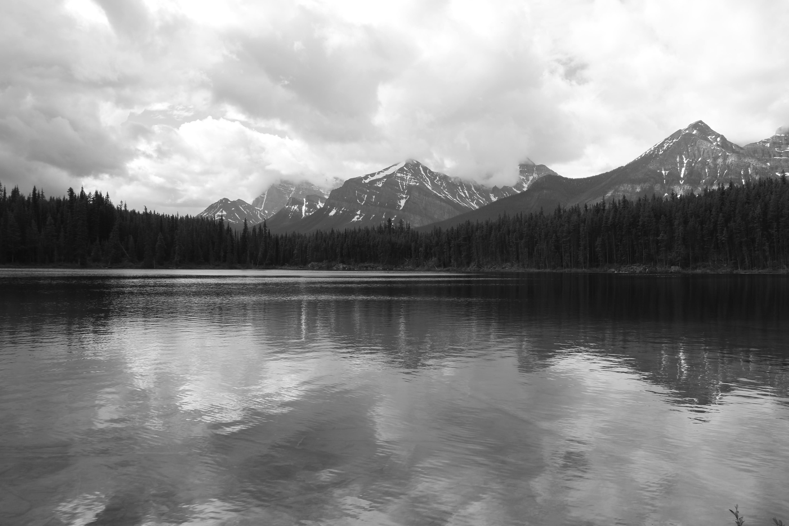
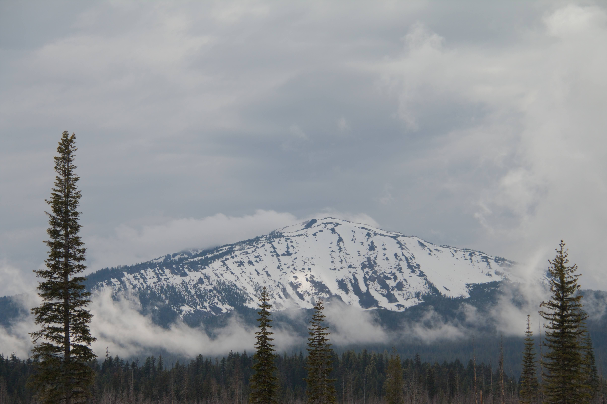

Professor H was walking without his usual companion today, so I decided to hitch onto his hike.

After some normal exchanges, he asked how my photography quest was going. I told him I’ve been taking black-and-white photos and trying to master post-processing software.

He didn't press further, and he steered the conversation toward Jared Diamond's *Guns, Germs, and Steel*.

His insight was that European dominance wasn't just about raw power, but how quickly they capitalized on gunpowder and advanced steel processing, while major powers in Asia limited or prohibited their use.

Had we circled back to photography, and had he asked why I was lugging around a two-pound, 12.3-megapixel camera introduced on August 23, 2007... this would have been my response:

> I am trying to match the output of a nearly two-decade-old camera to what modern algorithms think an optimal photo should be. Instead of letting software dictate how a scene ought to look, I want to preserve an image that captures the atmosphere and mood alongside the physical layout.

Sometimes I succeed. But most of the time, the smartphone wins with an algorithmic brilliance and overall optimization I can never quite duplicate manually.

Still, I will continue to carry this two-pound camera—even if its most practical use turns out to be a swinging weapon, like the one David used against Goliath.

------------------------------------------------------------------------

Professor H continued his climb after sharing his take on what historically built America's edge in R&D: open government policies that welcomed foreign talent, and an environment where that talent, once educated here, chose to stay and contribute rather than return home.

With that, I told him,

> "Well, I’d better go back."

I meant returning down the trail to Sister K, but the words held a double meaning—alluding to the possible return to my home country.

As I made my way down, contemplating the professor's views on history and policy, I ran into another regular near *The Kitchen* area—a runner who jogs the canyon rather than hikes it.

Seeing the DSLR heavy in my hand, he asked:

> "Did you see (capture) anything good?"

I simply replied:

> "Just people."

Had his inquiry veered, my answer would have remained unchanged.

It is the people who are the most interesting, the most variable, and ultimately, the most good.

In the end, we don't really capture anything truly new on sensor or film.

Similarly, we rarely manage to accurately capture what is most fascinating of all—the people around us—because, unlike the landscape, they are ever-changing.

.jpg)
