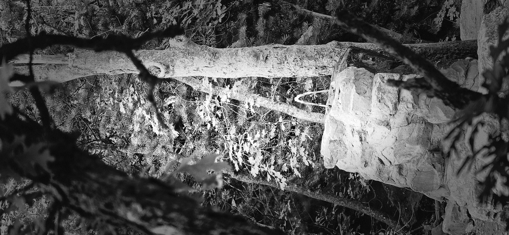
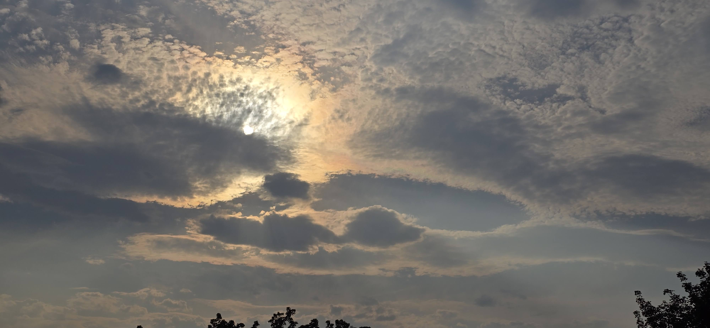

A famous actress who retired from acting and transitioned into a reclusive life in 1941 at the age of 36 stated:

> "There are many things in your heart you can never tell to another person.
>
> They are you, your private joys and sorrows, and you can never tell them.
>
> You cheapen yourself, the inside of yourself, when you tell them."

Another Japanese actress went into a private life at 43 years of age in 1963.

In the Book of Mormon, two records are mentioned.

One is more of a historical record: the reigns of kings and main events.

This was called the Large Plates.

Then another was kept—more spiritual, but limited in quantity when compared to the historical account.

They were known as the Small Plates.

Does that mean we need to keep two separate lives—one for the public and another for ourselves?

A majority of our lives dedicated to public, documented deeds and events, and when time remains, then we work on the small details?

------------------------------------------------------------------------

I have spent my allotted time searching, comparing, and envying the lives of other people, the revenues of other companies, and the relative wealth of other nations—all based on public knowledge and shared information.

When I come across an unfamiliar public figure, I do a quick search. Based on their background, education, and accomplishments, I form an opinion.

Likewise, reading about the return on investment, earnings per share, or humanitarian efforts of a corporation tells me what I think I need to know.

For the countries I have never visited, my imagination fills in the blanks using gross national product, test scores, and social media feeds.

Yet, despite all this data, I still don't know what personal crosses these public figures are asked to endure.

I don't know—and perhaps would rather not know—how decisions are truly made inside the corporations that shape our daily lives.

And I cannot begin to fathom how national policy is formulated, or what hidden inputs drive those choices.

If, by some random event, all this private information were suddenly made public, would my perceptions actually change? And more importantly—why would I expect them to?

------------------------------------------------------------------------

Nearly all spiritual leaders remind us that this is the life to prepare.

That we ought to spend more time dwelling on the eternal things, as Book of Mormon, among other spiritual documents encourage.

However, my use of time is not pointing in that direction.

I am left with a void.

------------------------------------------------------------------------

My parents did not retire from a public life.

But rather they let their private lives continue even after the normal retirement age.

Throughout their lives, there was no discrepancy between what was taught at home and what they practiced outside of it.

I need to work on this so that there is no difference between the accounts recorded in the small plates and the large plates

As that famous actress alluded, so that,

> I don't cheapen myself or my family when others find out more of my private life and realize that they were same as my public life.

