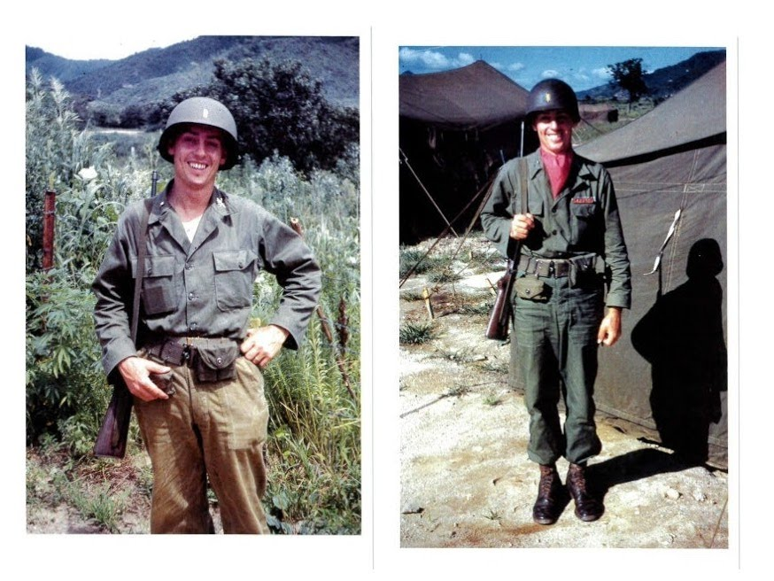
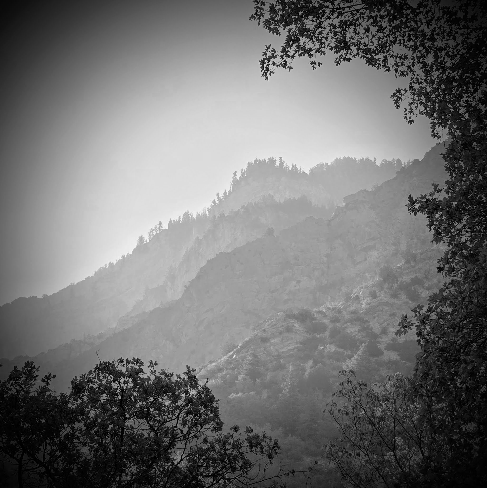
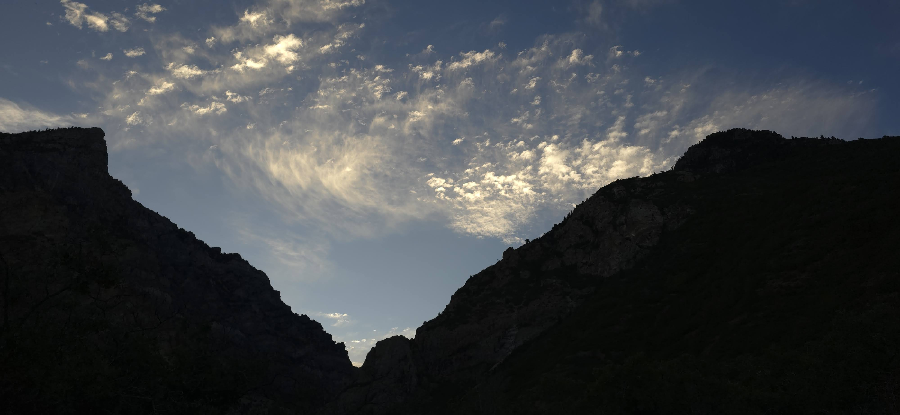

Hiking Rock Canyon provides a number of benefits. One of them is getting to know the regular hikers.

During a conversation, one mentioned that her father had served in the Korean War.

We learned that he had been teaching at BYU at the time I was attending, and he had lived right across the street from my in-laws.

Today, she sent me two photographs of him in uniform during his service in Korea.

Seeing those images from the 1950s reminded me of the war and memories of my own father, who also served in the war.

Furthermore, it made me think of the men who sacrificed so that our country could survive that war.

It also highlighted the contrast between an economic miracle built on freedom and hard work on one side, and a rigid political ideology still struggling to feed its people on the other, 73 years after the Armistice.

------------------------------------------------------------------------

Seventy-six years ago this month, North Korea had pushed the combined South Korean and UN forces to within roughly 80 km (50 miles) of the southern coastal city of Pusan.

But the tide was about to turn.

The North Korean offensive was reaching the limits of its logistical and military endurance.

And the surprise landing at Incheon, engineered by Douglas MacArthur a month later, would change the outcome of the war.

My parents’ generation in particular—and my own—retains a combined memory of the service and sacrifices made by many.

We remain deeply grateful to those who served honorably so that freedom could endure.

My father, who was from North Korea, served in the South Korean Army.

His older brother, who had followed North Korean ideology, could not fathom why my father would choose that path.

But according to my father, despite their initial military victories, the North was deeply ill-prepared.

He saw young North Korean soldiers sent into battle poorly clothed, poorly armed, and essentially unprepared—sacrificed in a war of competing ideologies.

When my father revisited Korea, 40 years after the war, the nation was in the middle of a stunning economic revival—a transformation many referred to as the "Miracle on the Han River."

Knowing the work ethic of his generation and their commitment to free-market principles, he was not surprised by their success.

---

The Korean War did more than preserve freedom in the South and install a regime in the North; it obliterated social traditions that were considered contrary to the ideology or had outlived their usefulness.

Obscure, unapproachable pseudo-religious practices were replaced by more defined, accessible organized faiths in the South and a deification of a father-and-son combination in the North.

In addition, rigid societal norms—such as strict class divides and heavy male preference—began to break down, laying the groundwork for modern, dynamic societies on both sides of the 38th Parallel.

The rising generation may not remember the sacrifices on the battlefield, nor how close South Korea came to total extinction in the summer of 1950.

To them, the prosperity of the South is the norm—the nation’s economic power that rivals or exceeds many of the very UN nations that once sent troops to save it.

However, in becoming as prosperous as "all the other nations," there is a danger: mistaking material wealth for a foundation.

It falls on the shoulders of current leadership and those preparing to lead next to distinguish between short-term material gains and long-term ideals.

What are the non-negotiable truths that are of worth?

Gerald O’Hara famously tells his daughter that land is:

> "the only thing in the world worth workin' for, worth fightin' for, worth dyin' for, because it's the only thing that lasts."

Wealth can slowly dissipate or altogether evaporate, economies fluctuate, and modern preferences fade.

But the moral agency of a free people—their faith in the eternal principles, their willingness to sacrifice for the future generations, and their memory of those who died for their friends—is the foundation that lasts.

