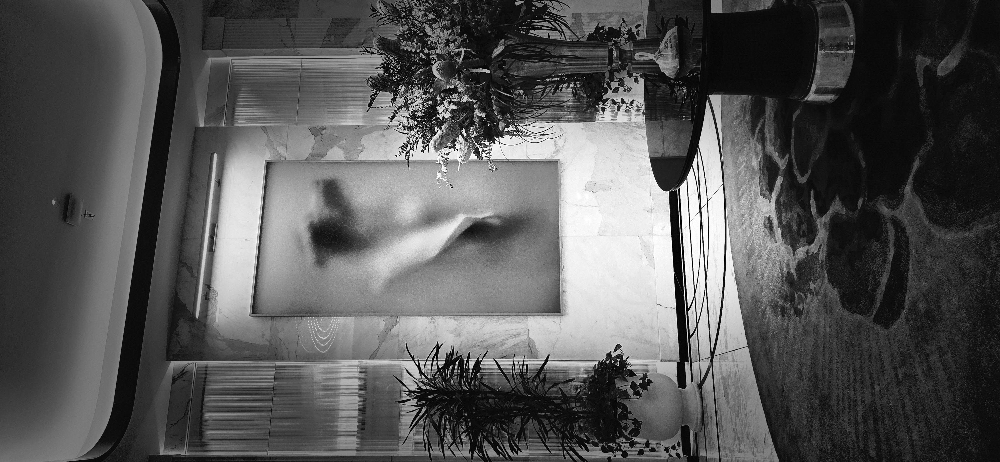
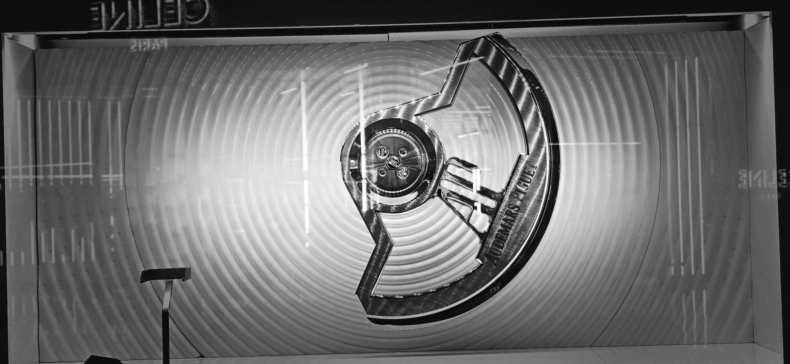
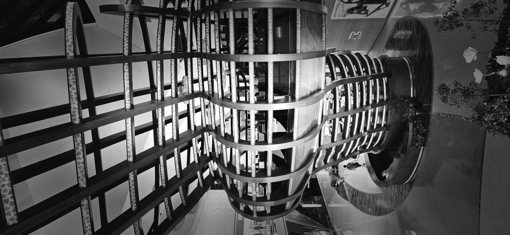

A drive from Saint George, Utah, to Mesquite, Nevada, is a 40-minute trip along Interstate Highway 15 through the Virgin River Gorge.

The journey feels like a high-speed roller coaster with a 1,200-foot drop, driving at a high rate of speed in a vehicle of your choosing.

The speed limits drop and rise along the way: 70 mph in the Utah portion at 2,800 feet above sea level, 65 mph in Arizona through the winding river gorge, and finally 75 mph across rural Nevada as you approach Mesquite at 1,600 feet.

In a setting like this, the difference between two concepts comes to mind: limitations and constraints.

Some may consider the state-mandated speed a limitation to be overcome, while others consider it a constraint to be reckoned with.

How we view the boundaries in our lives follows the same logic.

------------------------------------------------------------------------

After the simulated roller coaster is a dash toward a modern-day Oasis or Babylon, depending on your view: The Meadows, or Las Vegas.

If you meet the minimum age requirement of 21, there seem to be no limitations in this town. There are luxurious offerings of all kinds, lodging to meet every sort of need, and operations and outlets that never close.

However, a lack of imposed limitations does not mean an absence of boundaries.

Each person entering that town in Clark County has a purpose—a self-mandated constraint based on budget, life circumstances, or perceived needs.

------------------------------------------------------------------------

When I was younger, California—specifically Los Angeles—was the destination.

Las Vegas served as a logical stopping point along the way. Sometimes we stopped to eat, at times increasing the cost of our trip by contributing to the gaming establishments. Other times, we stayed overnight in subsidized accommodations at those same establishments.

In those days, the primary limitation was money.

Nowadays, it is time.

The freedom to set one's own constraints hasn't changed, however. The consideration of what makes a balanced life continues to be the ultimate boundary.

In the decades since my early visits and through a century of development, Las Vegas has refined its offerings and further blurred the lines between limitations and constraints.

------------------------------------------------------------------------

Our latest visit to this Oasis consisted of a one-night stay at a place that mimics a large city on the East Coast, two visits to a plaza that serves basic offerings that cater mainly to Korean Americans (with hours from 8 AM to 2 AM), and a walk through a mall that resembled a museum of luxury brands.

We might have increased the cost of our stay had we figured out how to wrangle those fancy machines to accept the cash we brought.

I still feel small, and my sense of worth seems to diminish as I visit this town.

Las Vegas has evolved, but so have I.

I am no longer limited by the visions offered by a society, but rather encouraged by the constraints demonstrated by my parents as they journeyed in this life—at times taking time to rest at an oasis along their travel toward physical and spiritual Zion.

And as we concluded our visit, we pointed our 20-year-old vehicle toward the Northeast and a home in Utah, not Southwest toward the City of Angels.

