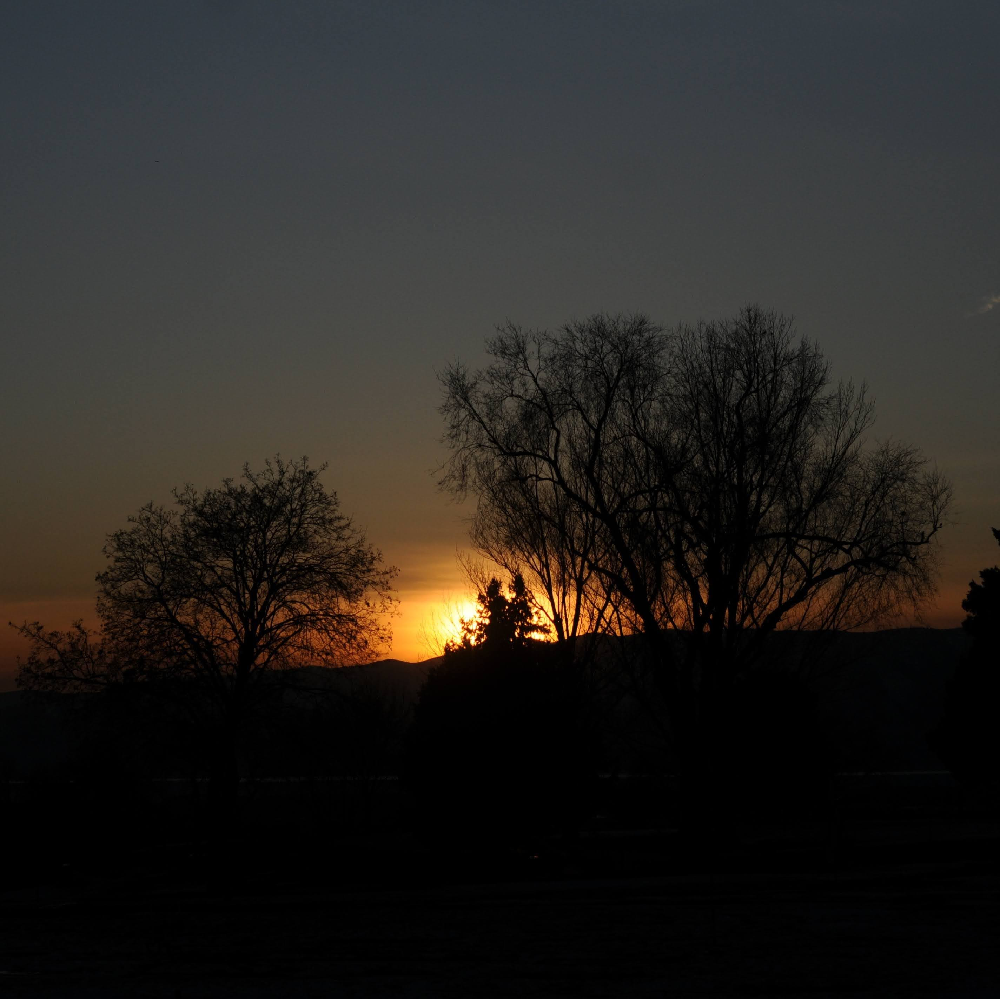
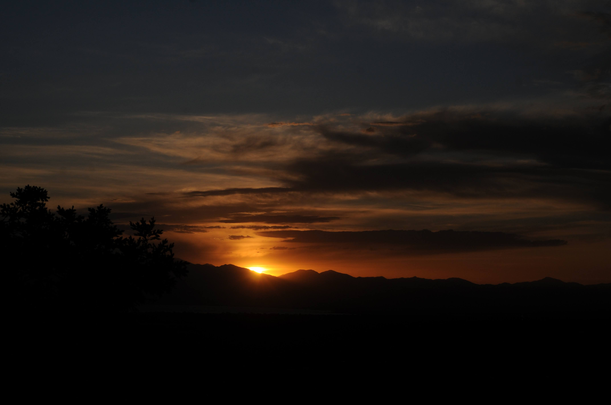

Growing up, I wanted an audio system with some power.

I longed for something that didn't just play Led Zeppelin’s fourth album at a home-listening level, but at a volume my neighbors could hear and feel through the walls.

Back then, there was no practical need for such a setup.

Instead a modest, integrated entertainment unit from Montgomery Ward was more than adequate.

It allowed me to enjoy my music, while sparing my next-door neighbors from discovering my taste in music.

Decades later, I now have enough equipment to service a small venue—or to invite my neighbors to participate in an impromptu listening party–without leaving their homes.

Yet, my need for loud music has subsided.

I just need enough sound, so that it is distinguishable from noise and I can clearly understand its message.

------------------------------------------------------------------------

Not surprisingly, the modern trend seems to dictate that louder is better and more pervasive means greater understanding.

Yet, more often than not, the message gets drowned out by the noise until the original intent is entirely lost or unheard.

Rather than amplifying the signal and the noise together—which only muddies the message further—perhaps we, both as a society and as individuals, need to judiciously apply a filter.

We must separate the background noise, either self-imposed or inherited, from the true signal.

Only then might we attend a gathering of our choice, confident that there will actually be real substance—spiritual meat—for us to consume, rather than leaving disappointed.

And perhaps then we, too, will experience what the prophet Elijah experienced on Mount Horeb:

> "And he said, Go forth, and stand upon the mount before the Lord. And, behold, the Lord passed by, and a great and strong wind rent the mountains, and brake in pieces the rocks before the Lord; but the Lord was not in the wind: and after the wind an earthquake; but the Lord was not in the earthquake:

> And after the earthquake a fire; but the Lord was not in the fire: and after the fire a still small voice." (1 Kings 19:11–12)

