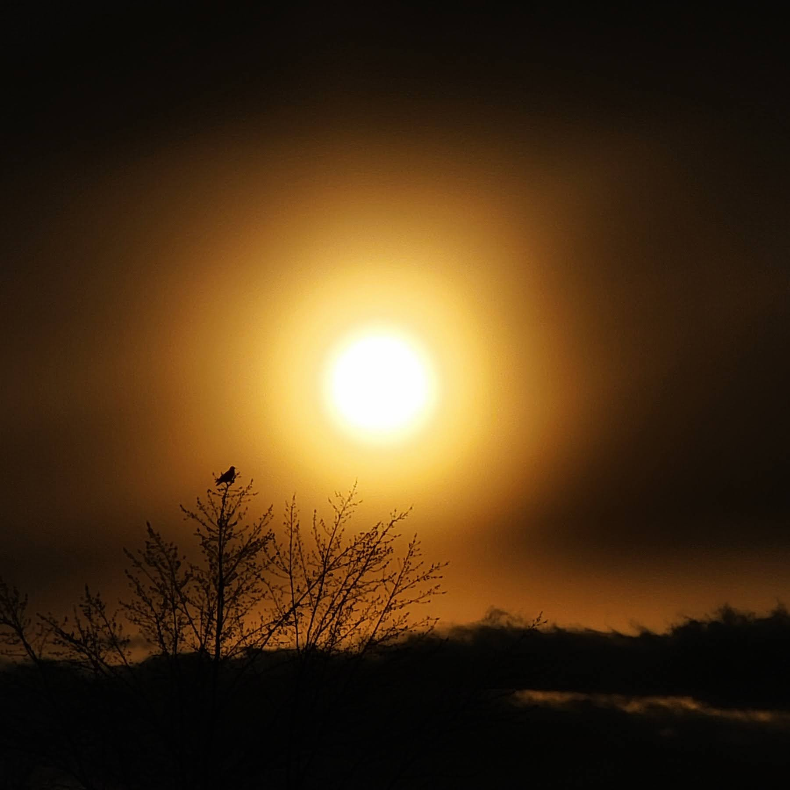

There are multiple ways to define professionals and amateurs.

In photography, one could say a professional captures an image that transcends the actual scene—translating an emotion or vision rather than just a physical space.

An amateur, on the other hand, leaves a record of the scene as it existed in that moment.

However, if the transcendent image ceases to represent reality, is it still non-fiction?

Or do we need to create separate categories altogether: fictional versus non-fictional photography?

------------------------------------------------------------------------

I recall a discussion with a young man over a photograph that captured the sunset over Horseshoe Bend along the Colorado River, just south of Page, Arizona.

The sky was brilliant with multiple colors, dotted with clouds and even the river itself contained hues one does not normally associate with a flowing river.

The young man insisted that this represented reality.

Having visited that exact location myself, I thought to myself: "maybe once in a hundred years, if all conditions were perfectly met."

We left that art gallery agreeing to disagree.

------------------------------------------------------------------------

Advancements in digital image capturing equipment and access to post-processing tools have enabled almost anyone to create extraordinary images—if they choose to do so. In the process, the lines between the efforts of amateurs and professionals, as well as between fictional and non-fictional images, are blurred.

What is the proper way to think through this digital dilemma?

Each person is endowed with a unique way of perceiving their environment, and each has a preferred method of capturing the moment. The traditional distinction between professionals and amateurs is inadequate; we need a different framework altogether—one that keeps alive the feelings, as well as the visual and auditory cues, of the original experience.

Unfortunately, a perfect method of preservation like that does not exist.

------------------------------------------------------------------------

Without digressing into a debate between analog and digital, a better framework might simply be a combination of both—with a return to human-centric preservation

Perhaps a handwritten trip report could replace a myriad of repetitive images from a well-known place.

A digital compromise might be a return to the personalized digital postcard—combining your own thoughts with a background crafted by a well-known artist.

Or maybe we adopt a "reporter on the scene" approach to capturing our visits, rather than relying on a barrage of short videos that seem to lose their relevance almost immediately.

Much effort has been made to enhance the tools of preservation, often with the unintended outcome of producing images that look nearly identical—or simply don't seem real.

Rather than worrying about whether an image appears professional or amateurish, it's time to reclaim originality.

And if all else fails, we can always return to hieroglyphs, oracle bone scripts, and cave paintings.
